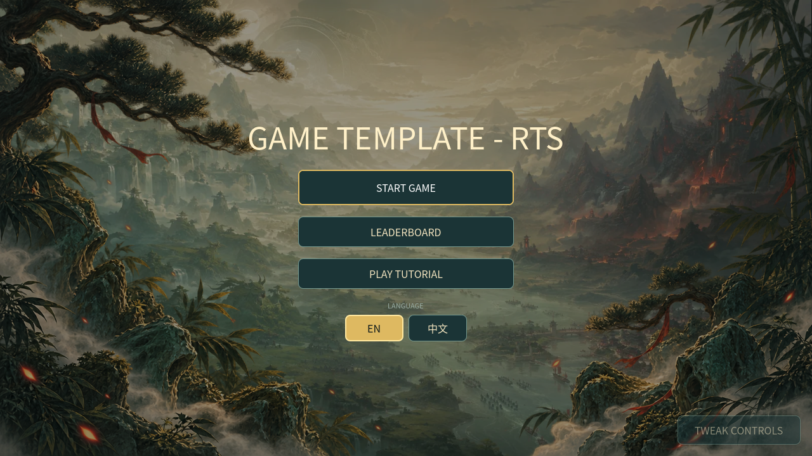

# Game Template — RTS Agent Guide

**Game Template — RTS** is a browser-playable Godot 4.7.2 real-time strategy scaffold. It currently ships one complete four-faction free-for-all skirmish on an 80 × 80 isometric map, with one human player, three AI rivals, asymmetric economies, fog of war, formations, fortifications, capturable monster dens, regenerative wildlife, a guarded escort objective, generated art and audio, settings, and a local leaderboard.[1] [2]

This README is the operational contract for an AI agent that must **reskin the existing game**, **extend it without regressions**, or **pivot it into another strategy game**. Read `AGENTS.md` before editing.



## 1. What exists and what still needs scaffolding

Do not describe a proposed capability as shipped. The current status is:

| Capability | Status | Agent guidance |
| --- | --- | --- |
| Complete game loop | **Implemented** | Title → faction selection → skirmish → result/rematch. |
| Playable stages | **One implemented stage** | The Fourfold Mandate is the current skirmish. Use the stage guidance below to add a tutorial or second scenario. |
| Start screen and faction selection | **Implemented** | Programmatically assembled in `scripts/main.gd`. |
| Match HUD, minimap, objectives, pause, and settings | **Implemented** | Preserve the alignment and input rules in this guide. |
| AI-generated background, foreground, characters, structures, UI, and cursors | **Implemented** | Runtime includes 94 processed visual assets derived from immutable source masters. |
| Visual effects, particles, fog filter, and game juice | **Implemented** | Bounded presentation records; they never own gameplay truth. |
| BGM and small SFX | **Implemented** | One looping score and 23 named SFX use a bounded audio director. |
| Local leaderboard | **Implemented** | Versioned local profile/history with backup recovery. |
| Hosted global leaderboard | **Adapter only** | The Web bridge exists, but this repository does not contain its host/backend. |
| First-play tutorial with callouts | **Not implemented** | The objective tracker and initial toast are guidance, not a tutorial state machine. |
| English/Simplified Chinese localization | **Not implemented** | Visible text is hard-coded English; there are no translation resources or `tr()` calls. |
| Durable gameplay/settings configuration | **Not implemented** | Current effect/audio settings survive screen rebuilds only for the current app session. |
| Config synchronization back to a sandbox/host | **Not implemented** | Add a validated versioned host bridge; a Web export cannot write directly to the sandbox. |
| Player-selectable difficulty | **Not implemented** | AI pacing is currently controlled by simulation constants. |

## 2. Non-negotiable architecture

> **Gameplay truth lives only in `RtsSimulation`.** UI, rendering, audio, fog display, effects, tutorial callouts, and developer tools may observe the model and submit validated commands; they must not become a second simulation.

| Layer | Primary files | Responsibility |
| --- | --- | --- |
| Application shell | `scenes/main.tscn`, `scripts/main.gd` | Builds title, faction, match, pause/settings, leaderboard, and result UI; owns application state and advances an unpaused match. |
| Authoritative model | `scripts/sim/rts_simulation.gd` | Players, entities, economy, fixed ticks, commands, pathfinding, visibility, AI, combat, objectives, score, victory, and semantic events. |
| Game data | `scripts/data/faction_catalog.gd`, `scripts/data/map_catalog.gd` | Faction identity/stats/capabilities/asset paths and authored map/scenario content. |
| Projection and view | `scripts/core/iso_projection.gd`, `scripts/view/` | Isometric conversion, camera, rendering, picking, fog presentation, minimap, and input translation. |
| Game juice | `scripts/view/effects/` | Bounded view-only effects, local transforms, hit flashes, health easing, and regenerated-wildlife fade-in. |
| UI system | `scripts/ui/` | Shared theme, command buttons, fallback icons, cursors, and leaderboard dialog. |
| Audio | `scripts/audio/audio_director.gd`, `default_bus_layout.tres` | Persistent score, cue routing, cooldowns, priorities, pitch variance, fog filtering, and a bounded 16-voice pool. |
| Persistence/services | `scripts/services/` | Local leaderboard profile/history and optional same-origin parent-window Web bridge. |

`RtsSimulation.advance(delta)` clamps one caller update to 0.25 seconds and executes fixed **1/30-second ticks**. The tick order is builder assignment, construction, passive Food, production, worker orders, combat/movement, unit separation, wildlife regeneration, egg synchronization, visibility, cave capture, AI, and state notification. Change this order only when a mechanic requires it and add regression coverage.[3]

### Command authority and queue lifecycle

Every gameplay action must use the validated public mutation surface: the `command_*` methods plus `set_rally(...)`. These APIs take an `issuer_team` and reject invalid or eliminated teams, rival ownership, dead or garrisoned actors, invalid targets, unavailable actions, bad bounds, insufficient resources/population, and invalid placement without applying the requested mutation. Most return `bool`; `command_deposit` returns the number of Workers whose cargo was deposited immediately—not the resource amount—while out-of-range or appended deposits are queued and return zero immediately. Cancellation and demolition return a result record or an empty dictionary. Do not call private `_spawn_*` helpers from production UI, AI, host bridges, or tutorial code.

Unit commands share one FIFO lifecycle. `Shift` appends only behind active or queued work; on an idle unit it activates immediately. A normal order replaces active work and clears that unit's queue, while Stop clears both. Each queued entry is revalidated when activated and stale entries are skipped. Garrison entry clears the queue. A successful append means **intent accepted**, not guaranteed later execution.

### Semantic events, fog privacy, and terminal state

Simulation presentation records are appended to one queue, and `drain_events()` consumes that queue destructively. Battlefield is the normal single consumer: it synchronizes entities, filters rival and neutral presentation/audio by the player's current visibility, then forwards audible records to `AudioDirector`. Player-team audio may bypass fog; other audio requires a current visible cell resolved from `position`, then `to`, then `from`. New semantic events must carry owning-team and world-location metadata. `battle_notice` is a separate UI signal; rival objective copy is deliberately generalized to prevent fog intelligence leaks.

The shipped shell blocks input on result and `advance()` stops ticking after an outcome. Public mutation methods are **not uniformly guarded by `outcome`**, so an external caller could mutate dormant post-result state. Extensions must stop issuing commands after `match_ended` or add and test a uniform terminal-command guard.

## 3. Game loop and stage strategy

### Existing one-stage game

The shipped loop is:

1. The title screen opens **Start Game** or the leaderboard.
2. The player chooses one of four factions.
3. `main.gd` creates a fresh simulation and Battlefield.
4. Each team starts with a Stronghold, three Workers, 320 Jade, 30 Lumber, 160 Essence, and 160 Food.
5. The player and three AI teams gather, build, train, hunt, capture dens, contest the Dragon Egg, and destroy Strongholds.
6. Player resignation or Stronghold loss is defeat. Destroying all three rival Strongholds is victory.
7. The first authoritative outcome is recorded locally, then the shell offers rematch, faction selection, leaderboard, and title navigation.

**Fresh-match contract.** `RtsSimulation.setup(selected_faction)` is a complete reset: it validates the map, clears entities/events/timers/counters/outcome, restarts entity and order IDs, resets wildlife and deterministic RNG state, and rebuilds pathfinding and visibility. Team 0 receives the selected faction; teams 1–3 receive every remaining faction exactly once, with team 1 retaining the catalog's legacy opposing matchup. Starts are indexed by team, not faction. Never retain entity IDs, player dictionaries, selections, queues, or events across a rematch.

**Outcome and elimination contract.** The only terminal outcomes are player elimination=`defeat` and no living rival Stronghold=`victory`; time, score, dens, the Egg, and Shenlong never end a match independently. Stronghold loss or resignation cancels that team's orders and queues, drops carried Eggs, kills its ordinary surviving units/structures, releases reserved population, and returns captured dens to neutral cleared state. Resignation does not award a killer or Stronghold death event. Raw `entities` can retain dead ordinary records, so use alive-aware query APIs. The result currently stores no defeat reason, so resignation uses the same Stronghold-loss copy.

### Authored terrain and scenario contract

`MapCatalog.TERRAIN_ROWS` is the canonical **40 × 40 macro-grid**; each macro cell expands to a 2 × 2 gameplay block, yielding the 80 × 80 map. Glyphs are `.` meadow, `+` road, `=` bridge, `~` water, and `#` ridge. Meadow, road, and bridge are walkable; ordinary facilities require meadow. Water, ridge, and out-of-bounds cells are blocked.[11]

| Scenario invariant | Current contract |
| --- | --- |
| Topology | Four corner islands and one central continent; four disconnected 20-cell Moon Bridge components are the initial crossings. |
| Team starts | Team 0 southwest; teams 1–3 northeast, northwest, and southeast. Each starts with a 2 × 2 Stronghold and three Workers. Reserved `war_camp` cells are preferred AI build sites, not starting buildings. |
| Finite resources | 24 authored Jade/Essence deposits plus 255 deterministic one-cell trees at 300 Lumber each. Lumber alone auto-retargets after depletion. |
| Neutral content | Four indestructible 2 × 2 dens with three guardians each; 20 herds totaling 68 animals; Shenlong at `(40,36)` and the Egg at `(40,40)`. |
| Symmetry caveat | Terrain and authored deposits/herds are symmetric; generated tree cells are deterministic but not mirror-paired. |

`RtsSimulation.setup()` asserts `MapCatalog.validation_errors()`, but that validator checks data shape and basic placement—not symmetry, bridge isolation/reachability, exact scenario totals, or every authored entrance invariant. `tests/map_test.gd` owns those scenario contracts. Update both validation layers when pivoting the map. Fortifications may be built on bridges, and placement does not preserve global connectivity, so a player can deliberately close a crossing.

### Recommended one-stage pivot

Use this path for a low-risk reskin. Preserve faction IDs, map shape, model commands, asset output names, UI node contracts, and tests. Replace source art, audio candidates, names, prose, colors, and theme. Regenerate derivatives, run focused tests, run the visual harness once, then export Web.

### Recommended two-stage pivot

Use two stages when teaching the game or introducing a larger rules change:

| Stage | Purpose | Recommended scope |
| --- | --- | --- |
| **Stage 1: Guided opening** | Teach selection, movement, gathering, construction, production, and one combat objective. | Smaller authored scenario, one opponent or scripted threat, tutorial callouts, constrained command unlocks, explicit completion condition. |
| **Stage 2: Full skirmish** | Exercise the complete RTS economy and neutral-objective race. | Current four-way map or a new full scenario with fog, AI economy, dens, wildlife, egg escort, and elimination victory. |

Add a data-driven stage definition rather than branching presentation code. A stage record should include a stable ID, map/scenario source, participating teams, starting state, enabled commands/mechanics, AI profile, objectives, tutorial sequence, completion rule, and next-stage ID. `main.gd` may choose and transition stages, but `RtsSimulation` must still own each stage's gameplay truth.

**Current limitation:** variable-roster stages are not supported today. `RtsSimulation` and `MapCatalog` are hard-wired to four teams/starts and elimination victory against three rivals. Before implementing a guided stage with one opponent or another participant count, parameterize setup/roster creation, map validation and spawn data, AI timers, terminal/objective rules, HUD denominators, and regressions. Do not merely add a stage record and hope the constants become philosophical.

## 4. Core RTS mechanics

### Factions

| Faction | Economy and combat identity | Food path |
| --- | --- | --- |
| **Celestial Court** | +15% deposited Essence; Mystics gain +0.8 range. | Rice Farms; cannot hunt. |
| **Demon Host** | A killer heals 12 HP and gains 3 Essence. | Hunter's Lodges and hunting; cannot farm. |
| **Beast Clans** | Worker, Hunter, Vanguard, and Mystic speed +18%; Vanguard Jade cost −15%. | Hunter's Lodges and hunting; cannot farm. |
| **Human Dynasty** | +10% deposited Jade; War Camps apply `round(base × 0.85)` separately to Jade, Lumber, and Essence only. | May farm and hunt. |

Faction display prose is not a mechanic. If a passive changes, update authoritative stats/deposit/kill/availability logic and tests. For a cosmetic reskin, preserve the `StringName` IDs and change only names, descriptions, colors, and mapped source art.

### Score and match statistics

`score`, `score_breakdown`, and simulation `lifetime_stats` are **current-match** player state and begin at zero; starting resources, units, and Strongholds score nothing. The breakdown must sum to total. Score comes from credited income after faction multipliers, completed production/construction, eligible enemy or neutral-guardian defeats, enemy structures destroyed, every den capture, and actual HP repaired. Ordinary wildlife contributes Food-income score but no defeat score. Queuing/cancellation, payments/refunds, starting assets, self-demolition, resignation, victory, and Shenlong hatching add no direct score. The leaderboard persists run score/result/faction/time and profile aggregates—not this breakdown or the simulation statistics.

### Economy, construction, repair, and production

Workers gather Jade, Lumber, and Essence in 10-unit cycles every 0.8 seconds, carry one resource kind up to 50, and bank only at a living own Stronghold. Reassignment to a **different gather kind** first banks the old load; same-kind gathering and move, attack, build, repair, Stop, or death do not. Cargo is lost when a Worker dies. Trees and deposits are finite. Lumber alone retargets another tree after depletion. Passive Food, hunting/guardian bounties, and Demon kill Essence grant stockpiles directly and do not receive cargo-deposit multipliers.

A valid building placement charges its full faction-adjusted cost immediately and creates an alive, path-blocking foundation at 6% completion and HP. Each in-range Worker contributes `delta / 8` construction progress; multiple builders stack linearly, and idle friendly Workers automatically join nearby incomplete structures. Carried cargo is not automatically banked first.

Only a Worker can repair a living, completed, damaged friendly structure. Every 0.5-second cycle costs 1 Lumber and restores up to 15 HP; a partial final cycle still costs 1 Lumber, multiple Workers stack, and zero Lumber pauses rather than cancels the assignment.

Completed producers accept only mapped units: Stronghold→Worker, War Camp→Vanguard/Mystic, Hunter's Lodge→Hunter, captured Den→Jadeclaw. Queues have no coded length cap; full cost and population are reserved immediately, but only the FIFO head advances. Explicit cancellation refunds the entry's recorded costs and releases population. **Forced** clearing after producer death, demolition, elimination, or den recapture releases population only; paid resources are lost. Specific UI cancellation must match both queue index and stable `order_id` so a stale tile cannot cancel a different item.

A team with no living or queued Worker may queue one zero-resource recovery Worker, but it still reserves one population and trains for the normal six seconds. Stronghold upgrades are immediate commands—not queue items—and raise capacity 24→30→36 for 200 then 300 of every resource. Completed units spawn on a nearby walkable cell and then receive an ordinary move order to the normalized rally cell.

Rice Farm timers run even while unstaffed. A payout is 8 Food normally or 40 only if its single assigned Worker is still empty-handed, not carrying the Egg, assigned to that Farm, and in interaction range. The final builder is automatically assigned when the Farm completes. Hunter's Lodges always produce 18 Food every 50 seconds and their Hunter queue is independent.

Demolition is immediate for owned buildable structures and foundations—War Camp, Farm, Lodge, Wall, Gate, or Tower—but never Strongholds or Dens. It refunds `floor(50% × current faction-adjusted build cost)` per resource and then uses ordinary structure-death cleanup; queued-unit resources are not refunded.

### Combat, targeting, movement, and navigation

The command surface supports move, attack, attack-move, gather/deposit, Farm staffing, Egg claim/return, stop, resign, repair, construct, garrison/ungarrison, patrol, fortification/structure placement, production/cancellation, Stronghold upgrades, and rally points.

**Targeting, fog, and firing.** A direct attack requires hostility and **current** team visibility; explored fog is insufficient. It does not require line of sight at issue time, so a visible obstructed target may be ordered and approached. Automatic acquisition requires current visibility and line of sight, and every hit requires footprint-adjusted range plus line of sight. Non-walkable terrain and every living structure/resource footprint block sight; units/wildlife do not. The attacker and target are excluded as endpoint blockers, and garrison fire also excludes its own tower.

**Navigation topology.** A* contains static walkability plus every living structure/resource footprint, including incomplete foundations; live units and wildlife are deliberately absent. Construction placement and resource/structure death rebuild the graph and increment its revision. Preserve both A* and runtime diagonal no-corner-cut checks. Friendly ordinary structures and gates are relaxed only for their owner's path calculation; friendly walls/towers and all enemy structures remain solid, and friendly pass-through never removes line-of-sight blocking.

Public move, patrol, and rally reject out-of-bounds destinations. An accepted but unreachable move, attack-move, or patrol retains its saved goal and retries every 0.55 seconds until topology changes or another order replaces it. Formation cells are unique global-grid walkable cells allocated in caller selection order; if space is insufficient, only a prefix receives orders. Friendly building footprints can be crossed but are not formation landing cells.

Live actors use post-movement soft separation, not A* crowd blocking. Same-team units may overlap whenever either has an active path, including a moving unit passing a stationary ally, then spread while idle. Hostile actors and retaliating wildlife separate; harmless chicken/deer/bison do not separate from units. Workers are the slowest roles and use heavier damping than combat units. Attack-move and patrol resume their saved destinations after combat; patrol is military-only.

### Fortifications and garrisons

Walls are 1 × 1, gates are 4 × 2 on map X or 2 × 4 on map Y, and towers are 2 × 2. A wall drag includes both endpoints, snaps to the dominant map axis, and breaks a diagonal tie toward map X. Gate orientation breaks the same tie toward map Y. A same-team wall may occupy a gate corner, and perpendicular same-team walls may share one cell; no other static overlap is legal.

Placement checks every origin-anchored footprint cell against terrain, living structures/resources, and rounded cells of live non-garrisoned units/wildlife. Facilities require meadow; walls, gates, and towers may use meadow, road, or bridge. Foundations block routes immediately. There is no global connectivity check after placement.

A completed Sentry Tower holds two Hunters or Mystics. Garrisoned units are not directly commandable and do not target wildlife. Each occupant keeps normal damage and cooldown, gains 2× range, and still requires current team visibility and line of sight. Tower vision is radius 6 or the doubled range of its first occupant, whichever is larger. Capacity is enforced at entry; surplus separately issued in-transit orders resolve idle on the ground. Tower death ejects surviving occupants.

### Wildlife, caves, and the Dragon Egg

Only Hunters from hunt-enabled factions may target wildlife, and they deal triple wildlife damage. Chicken/deer/bison flee and yield 8/19/45 Food; boar/bear retaliate and yield 31/60. Passive wildlife is non-separating; retaliators pursue only their attacker and abandon it outside `herd_radius + 3`, while flee destinations may extend to radius +2.

Regeneration is per herd. While below cap, one replacement becomes due every `300 ÷ authored_count` seconds: a fully empty herd refills across five minutes, while one missing member returns after one interval. A blocked spawn stores at most one interval and retries later, preventing bursts. Candidates must be in bounds, non-solid, and unoccupied. `wildlife_regenerated` is a view-only semantic event; after visibility filtering, `PresentationState` fades the new entity from transparent to opaque over 0.85 seconds.

Yaoguai Dens are indestructible 2 × 2 obstacles. After their three leashed Jadeclaws die, any living military kind except Worker may capture within 2.8 cells. Two or more eligible teams freeze progress; no eligible team decays it at 0.5 per second; a new capturing team restarts it; the owner's nearby military resets a takeover. Six accumulated uncontested seconds captures the Den. Recapture or owner elimination leaves it alive and cleared, cancels the former queue without resource refunds, and never converts existing Jadeclaws.

The Egg is unattackable and unlocks when guardian Shenlong dies. Multiple empty Workers may race claim orders; the first to interaction range wins. Claim starts a return-home order, but the carrier remains normally commandable and cannot gather. Carrier death, Stronghold loss, or elimination drops the Egg onto a nearby walkable cell. **Current compatibility quirk:** the Egg is an objective, not a static occupancy blocker, so otherwise-legal structures may be placed on its cell. Preserve that deliberately or reserve the cell and add path/interaction tests.

Hatching is free, consumes the Egg, bypasses normal production and population-room validation, and still adds Shenlong's population value of 8. A full team therefore becomes over cap by 8 and cannot queue more population until capacity exceeds the new total. Hatching awards no `units_created` score.

### AI pacing and limitations

The three AI teams use the same stockpiles, faction gates, costs, population accounting, and command APIs as the player and receive no periodic stipend. Their information model is hybrid: direct attacks and acquisition obey current team visibility, but the strategic planner reads global state to choose unseen Stronghold, Den, Shenlong, and resource coordinates, then legally moves or attack-moves toward them. A fair-scouting pivot must replace those selectors with discovered knowledge.

Stock AI is intentionally narrow. It grows to five living Workers, rebuilds one missing War Camp, establishes at most one legal Food structure of each supported type, staffs one Farm, trains at most two Hunters, and never upgrades its Stronghold beyond the base 24 cap. It does not autonomously repair, fortify, garrison, set rallies, demolish, or cancel. Any new command or balance dependency needs an explicit AI branch and regression coverage.

Before normal base assaults, an AI with military units and no owned Den prioritizes the nearest non-owned Den and stops pursuing Dens after its first capture. This branch can suppress ordinary pressure if the first Den is unreachable. After the AI-only ten-minute lock, Shenlong outranks cave/base assault, requires eight ungarrisoned military units, and receives the whole military roster; the first eligible Worker in entity order claims the Egg. Stock AI does not deliberately intercept an enemy carrier.

AI policy starts after 0.5 seconds and runs every 1.4 seconds. Ordinary assaults require four idle military units but commit three; team timers are staggered, and a successful target selection resets a 28-second assault timer. At 60 minutes each AI retries a one-time full-army invasion until an order succeeds, then latches permanently. There is no difficulty selector; add difficulty as explicit simulation configuration, never as hidden resource cheating.

## 5. UI, HUD, alignment, and input rules

All screens are created programmatically in `scripts/main.gd`; `scenes/main.tscn` contains only the root application node. Preserve focus, modal, and screen-rebuild contracts when editing the UI.[4]

### State and overlay lifecycle

The only top-level states are `title`, `faction`, `match`, and `result`. Pause and Settings are modal views over `match` guarded by `paused`; Leaderboard is a reusable modal; Result is a child overlay that changes state to `result`. `_make_screen()` destroys the prior screen and clears its UI/Battlefield references. Root-owned `AudioDirector`, leaderboard services, presentation settings, and objective-collapse state survive screen rebuilds.

### Screen inventory

| Screen or overlay | Existing contents | Required behavior |
| --- | --- | --- |
| Title | Covered key art, title, Start Game, leaderboard | Start receives initial keyboard focus. |
| Faction select | Four catalog-driven portrait cards, Back, control legend | First faction receives focus; callbacks keep the selected faction ID. |
| Match HUD | Score/resources/population/dens/time, objectives, minimap, inspection/selection, production and 4 × 3 command grid | Read state from simulation; expose commands only for valid player-owned selections. |
| Pause | Resume, Settings, Resign | Stops simulation and Battlefield input; Resume receives focus. |
| Settings | Audio, effect quality, reduced motion, camera impulse, damage values | Applies immediately to the active view; root-session values survive rematch. |
| Leaderboard | Local/Global tabs, callsign, status, ten rows | Opens above title/result overlays and restores initiating focus on close. |
| Result | Victory/defeat, rematch, leaderboard, faction select, title | Shell records once and blocks GUI input; external command callers must also stop. |

The HUD is reconciled from authoritative state every 0.1 seconds and immediately after selection changes. The production strip aggregates owned producer queues; each tile carries producer ID, queue index, and order ID. Do not cache gameplay truth in controls.

### Reference geometry and command-card constraints

The reference viewport is **1280 × 720** with `canvas_items` stretch. Major roots use anchors, but the layout has no reflow, breakpoint, scrolling, or UI-scale system.

| Region | Reference rule |
| --- | --- |
| Title action stack | Centered, approximately 520 × 218; primary/secondary actions approximately 340 px wide. |
| Faction cards | Centered 1180 × 500 row, 14 px separation; each card approximately 284 × 500. |
| Top HUD | Full width; 8 px side and 6 px top inset; 50 px height; 40 × 34 pause/audio controls. |
| Bottom HUD | Full width; 8 px side/bottom inset; 234 px height; 236 px minimap, flexible selection panel, 424 px command bay. |
| Command grid | 4 × 3 slots; each approximately 98 × 66. Keep persistent command modes grouped and visibly armed. |
| Objective tracker | Position approximately (10, 64); 326 × 154 expanded or 58 px collapsed. |
| Toast | Centered above the bottom deck, approximately 440 × 38. |
| Pause/settings | Centered approximately 420 × 380 and 460 × 560. |
| Leaderboard | Centered approximately 920 × 660; ten 31 px rows. |

The 4 × 3 command card is **multiplexed**, not one-command-per-cell: production and build controls intentionally share slots, and visibility is computed independently. Mixed selections can therefore place multiple visible sibling controls in one slot, where draw/hit order matters. Define and test an explicit conflict policy before adding mixed-selection commands.

Use `ThemeFactory` for shared colors, panels, buttons, progress bars, spacing, and modal styles. Test at 1280 × 720 and a narrow/short viewport. Add breakpoints, scrolling, or UI scale before claiming mobile-native support.

### Input, selection, and focus invariants

`Escape` cancels an armed command, then clears selection, then pauses. Armed Build, Move, Attack-Move, Patrol, Repair, and Rally modes persist after valid or rejected destinations until toggled or cancelled; a mode armed with Shift keeps append intent. `R` rotates active placement before it can arm Repair. While paused, gameplay input is consumed.

`Space` is intercepted before focused HUD controls and queues the first available unit from the selected producer. `P` pauses/resumes; `Q/I/E/H` select all Workers/idle Workers/army/Stronghold; `F/T/R/X` arm Attack-Move/Patrol/Rotate-or-Repair/Stop. Digits `0–9` recall control groups; Ctrl/Command assigns, Ctrl/Command+Shift appends, Shift-recall merges selection, and a second unmodified recall within 450 ms centers the camera. `M` toggles audio outside an open leaderboard modal.

A click may inspect any rendered selectable entity, including rivals, neutrals, resources, wildlife, and objectives; command extraction still filters to player ownership. Selection de-duplicates and removes dead/garrisoned IDs. Drag starts at 6 screen pixels, tests projected anchors rather than sprite bounds, and selects only alive non-garrisoned player units. Shift-click toggles; Shift-drag adds without removing existing members.

Contextual right-click is an ordered dispatcher: garrison, Egg claim, wildlife hunt, Den attack-move, hostile focus fire, allied construction, Farm staffing, Egg/cargo return, repair, gathering, structure rally, then ground move. A normal move onto a claimable Egg cell may convert eligible Workers to claim orders; attack-move does not.

### Isometric alignment, picking, fog, and camera

`IsoProjection` defines 96 × 48 diamonds:

```text
screen_x = (map_x - map_y) × 48
screen_y = (map_x + map_y) × 24
```

Use `IsoProjection.position_center`, `entity_screen_position`, and existing map/screen conversion helpers. Unit/wildlife feet and selection rings share the tile center; static art grounds on the southeast footprint edge. Painter order is ground depth, x, y, then entity ID. Garrisoned units are omitted from ordinary rendering and composited into tower slots.[5]

Contextual command targeting samples transformed sprite alpha, not a bounding rectangle. One opaque hit wins; **zero hits return no contextual target**; only overlapping opaque silhouettes fall back to tile anchors, prioritized units, wildlife/objectives, structures, then resources. Rendering is not command authority: explored static enemies/resources may remain pickable while `command_attack` rejects them outside current visibility. Click and box selection use their separate anchor rules.

Simulation owns per-team visible/explored cells. Battlefield refreshes player copies every 0.1 seconds and uses them for world rendering, picking, effects, and audio. Player entities always render; explored hostile structures remain as last-known static state; hostile/neutral units and wildlife require current visibility. Fog-off is presentation/debug state only and does not change command vision or AI knowledge. The minimap consumes Battlefield's same policy and is not an independent authority.

Camera state is presentation-only. Initial fit reserves HUD space and focuses the player's Stronghold. Zoom is cursor-anchored and clamped to 0.14–1.30; Ctrl/Meta wheel and pinch zoom, middle-drag pan, keyboard smoothing, minimap centering, and 150 × 120 px map guard margins are current contracts. Preserve projection/minimap tests when altering camera UX.

## 6. Presentation, particles, filters, and game juice

The presentation layer is deterministic and bounded. `EffectDirector` owns short-lived pulses, trails, impacts, particles, values, traces, residues, and camera impulses. `PresentationState` owns local attack/hit/selection/hover transforms, eased display health, and wildlife spawn opacity. Neither writes model state.[6]

The current feedback vocabulary includes selection/hover rings, placement ghosts, invalid-command pulses, dotted order routes, move/attack/rally/build/repair markers, four attack families, hit flashes, aggregated values, construction/repair motes, death snapshots/residue, movement facing/bounce/lean/squash/dust, tree sway, water sheen, Stronghold aura, Shenlong waves/wisps, and wildlife fade-in. Invalid feedback is mode-specific; do not claim every rejected command produces the same pulse/toast unless behavior and tests are normalized.

### Fog/filter and rendering performance contracts

The existing filter layer is battlefield fog plus organic map-edge fade; water has its own sheen/tint. Add color grades, weather, vignettes, or faction vision modes to Battlefield presentation, not simulation. Keep HUD outside destructive grading, draw fog after the world, and preserve hidden-event filtering.

The renderer uses intentional LOD. Below scale 0.25, only macro-grid-aligned trees render and pick; the grid requires at least 0.25; tree sway, water sheen, ambient leaves, and animated Shenlong mesh/aura require at least 0.28. Texture alpha bounds, ground profiles/slopes, pick masks, and entity textures are cached. Preserve these gates and rerun performance/visual checks when changing map scale, art paths, or sprite analysis.

### Effect, value, and death contracts

Full quality caps particles/trails/impacts/values/traces/pulses at **96/24/24/12/24/12**; Low caps them at **40/12/12/6/10/8**. Death snapshots cap at 16 Full or 8 Low and camera kicks at 4. At saturation, the director evicts an earliest record only when its priority is no greater than the incoming record; otherwise it drops the new low-priority effect. Critical events suppress ambient particles for 0.35 seconds.

Floating values last 0.82 seconds and aggregate same-target/same-kind events inside 0.15 seconds. Contextual damage hides hits below 8; All shows every nonzero value; Off suppresses values only. Health bars combine actual HP with eased display HP and an orange delayed-damage segment; full-health bars are hidden unless selected. Preserve selected-tree resource bars, food timers, Den guardian/capture state, and Worker cargo/Farm markers.

Death visuals are event-backed snapshots after the model entity leaves normal rendering. Unit/wildlife snapshots live 0.82 seconds and structures 1.18 seconds, followed by independent trace/rubble residue. Draw them after live entities but before overlays/fog. Reduced Motion retains semantic fades/residue but removes collapse transforms. It also removes lunge, camera kick, foot dust, lean/squash, and other nonessential accents; it does **not** make the battlefield fully static—walking bounce, deterministic idle motion, water/tree ambience, aura effects, and selection pulses may remain.

Effect settings are `Full/Low`, Reduced Motion, `Off/Major/Full` camera impulse, and `Off/Contextual/All` damage values. New effect families need a priority, bounded lifetime, cap behavior, saturation coverage, and a reviewed capture state.

## 7. Full visual reskin playbook

### Runtime asset inventory

A complete same-shape reskin replaces **94 runtime visual outputs**. The repository currently has 103 source PNG masters because some retired alternatives and paintovers are retained outside the runtime catalog.[7]

| Category | Count | Runtime outputs and generation rules |
| --- | ---: | --- |
| Title key art | 1 | 1600 × 900 RGB WebP; opaque 16:9 battlefield composition; no embedded title, logo, UI, or text. |
| Faction portraits | 4 | 360 × 480 RGB WebP; opaque 3:4 commander portraits with consistent framing. |
| Terrain materials | 6 | 512 × 512 RGB WebP for meadow, ridge, water, forest, road, bridge; seamless, top-down, full bleed. Forest is packaged but dormant in the shipped map. |
| Faction units | 15 | Worker/Vanguard/Mystic for four factions plus Hunter for Demon/Beast/Human; isolated, complete, three-quarter isometric, bottom-grounded. |
| Faction structures | 20 | Stronghold, War Camp, Wall, Gate, Sentry Tower for four factions; match footprint and orientation contracts. |
| Shared specials | 6 | Jadeclaw, Shenlong, Dragon Egg, Yaoguai Den, Rice Farm, Hunter’s Lodge; remain neutral/shared unless routing changes. |
| Wildlife | 5 | Chicken, deer, bison, boar, bear; distinct scale and silhouette; isolated and bottom-grounded. |
| Foreground resources | 6 | Jade outcrop, Essence shrine, pine/cedar/fir/juniper trees; no scenery or detached shadow. |
| HUD/command/cursor art | 31 | Idle alert, 6 resource icons, 4 utility icons, 3 command indicators, 17 cursors. Preserve exact semantic names and hotspots. |

### Master-generation contract

Do **not** hand-edit `assets/runtime/`, and do not overwrite an old source master in place. Add a new immutable source master, update the mapping in `tools/process_assets.py` when the source name changes, and keep the existing runtime output name unless code and tests deliberately change.[1] [7]

Use three background classes:

| Asset type | Source background |
| --- | --- |
| Title, portraits, terrain | Opaque full-frame art. Terrain must tile and contain no foreground object. |
| Isolated characters, buildings, wildlife, most resources/icons | Perfectly uniform edge-to-edge **`#FF00FF`** magenta; no gradient, noise, glow, cast shadow, or stray marks in the negative space. |
| Cursors, command indicators, Food icon, Audio Muted icon | Real transparent alpha; never render a checkerboard into RGB. |

**Current exception:** `assets/source/buildings/demon_wall.png` must use real transparency because its processor rule preserves source alpha. A magenta-backed Demon Wall would retain magenta in the runtime image. To remove this exception, change `tools/process_assets.py`, regenerate the derivative, and update the asset/fortification tests together.

A reliable GPT Image 2 prompt includes: **single subject**, gameplay role, faction material/palette, exact three-quarter isometric or top-down camera, readable silhouette at target size, bottom-center ground contact, soft consistent lighting, generous clear margin, and explicit exclusions for scenery, text, logo, watermark, cropping, multiple subjects, detached shadow, particles, and glow. Generate every faction family under one art-direction sheet before generating individual assets so scale, lighting, camera, and material language remain coherent.

Functional structure prompts must reflect gameplay: a repeatable 1 × 1 wall segment; a 2 × 4 gate with a legible opening; a roofless/open-platform 2 × 2 tower that can visibly hold two units; a 2 × 2 Stronghold/Farm/Den; and compact 1 × 1 Camp/Lodge. Preserve the aligned source overrides for current Celestial Wall and Demon Gate, or intentionally revise their processor/render rules and fortification captures.

### Processing and validation

```bash
cd /home/ubuntu/proto-rts
python3 -m venv .venv
.venv/bin/python -m pip install Pillow
.venv/bin/python tools/process_assets.py
sha256sum -c assets/runtime/SHA256SUMS

GODOT_BIN=/path/to/Godot_v4.7.2 tools/run_tests.sh
```

`tools/process_assets.py` rebuilds every **currently mapped** derivative and writes `assets/runtime/asset-report.json` plus `assets/runtime/SHA256SUMS`; it does not prune stale outputs. Inspect source selection, dimensions, color mode, alpha extrema, hashes, and the runtime filesystem inventory. The packaged sixth terrain texture, `jade_forest.webp`, is prepared but dormant: `MapCatalog.terrain_at` currently emits only meadow, ridge, water, road, and bridge. Define forest walkability/buildability, minimap/rendering behavior, validation, and tests before activating it.

**Renderer-facing contracts.** Replacement art must preserve the path's native-facing entry in `Battlefield.NATIVE_RIGHT_FACING_ART`, faction-specific gate/wall fit overrides, and the fixed Sentry Tower rooftop composition area; otherwise update renderer metadata and focused captures/tests. Cursor derivatives are centered 64 × 64 canvases, but hotspots are hard-coded: Select `(3,3)`, UI Action `(20,4)`, Rally `(32,49)`, and `(32,32)` for the other states. Design the visible pointer around those coordinates.

**Mapping and manifest traps.** Runtime `celestial_wall`, `demon_gate`, `human_hunter`, and `hunters_lodge` derive from `celestial_wall_aligned.png`, `demon_gate_aligned.png`, `human_hunter_female.png`, and `hunters_lodge_v2.png`; consult `asset-report.json`, not basename guesses. `tools/process_assets.py` rewrites mapped derivatives and manifests but does **not** delete obsolete no-longer-mapped runtime files. Remove retired tracked outputs deliberately. `assets.lock.json` is an external provenance lock, covers only part of the runtime catalog, ships in the PCK, and is not a completeness, checksum, or regeneration authority. `tests/assets_test.gd` also does not recompute the visual SHA manifest, so checksum/report review remains a separate gate.

Review units at several zoom levels; both wall/gate orientations and corners; tower occupant clearance; terrain tiling; tree/resource readability; cargo and Farm markers; command indicators; all cursor hotspots; and fog contrast. Run the native visual harness once after visible changes.

## 8. BGM and SFX reskin playbook

### BGM

The game uses one persistent looping score. Screen state changes gain instead of restarting playback. For a new reskin, use Manus **`generate_music` with Lyria 3 Pro or the latest available Lyria model**. Request an instrumental, loop-friendly strategy underscore with no speech or vocals, restrained dynamics under UI/SFX, a stable pulse, no abrupt final cadence, and instrumentation tied to the new setting. Generate and review a source comfortably longer than 12 seconds; two to three minutes is a useful production target.

If retaining the current path contract, place the reviewed source at the configured candidate root as `bgm/the_jade_meridian_endures.wav`. **Before processing a Lyria score, update `tools/process_audio_assets.py` so its report generator/provider/model metadata is supplied explicitly rather than using the current hard-coded legacy ElevenLabs value.** Add a validation assertion for that metadata, then process the score. Do not ship an `audio-report.json` that attributes Lyria output to ElevenLabs. Changing the BGM basename also requires updates to `AudioDirector`, manifests, asset tests, and the runtime file together. The current checked-in score was generated with Manus/ElevenLabs-era tooling; do not claim Lyria provenance until a Lyria reskin is actually generated.[8]

### Small SFX

Prefer an ElevenLabs-powered **`generate_sound_effect`** tool when available. Generate three materially distinct, equal-duration A/B/C variants for each cue. Concatenate them in A→B→C order into one reel at `/home/ubuntu/proto-rts-audio-candidates/reels/<cue>.mp3`; the processor splits that file into equal thirds. Use `--candidates /another/root` when storing reels elsewhere. Prompts should request one short, isolated, dry sound; no speech, music bed, long reverb, ambience, or stacked sequence. Keep frequent economy/combat ticks quieter and shorter than objectives, destruction, victory, or defeat.

If the ElevenLabs SFX tool is unavailable, instruct Manus to implement a small Godot fallback using `AudioStreamGenerator` or generated `AudioStreamWAV` data. Route the substitute through the same `AudioDirector` cue name, bus, cooldown, priority, and voice cap. Do not play procedural sounds directly from HUD or simulation code.

The existing SFX contract contains 23 names:

| Family | Cue names |
| --- | --- |
| UI | `ui_confirm`, `ui_cancel`, `ui_error`, `unit_select` |
| Orders | `order_move`, `order_attack`, `order_work` |
| Economy/build | `deposit_resource`, `harvest_food`, `repair_tick`, `structure_placed`, `structure_complete`, `unit_ready` |
| Combat | `attack_melee`, `attack_ranged`, `attack_magic`, `attack_beast`, `impact_damage`, `unit_death`, `structure_destroyed` |
| Objectives/results | `objective_secured`, `victory`, `defeat` |

`structure_complete` is packaged but intentionally not mapped for generic structure completion. The retired `gather_resource.ogg` must not be restored. Battlefield filters simulation audio before `AudioDirector`: own-team events are audible; other events need fog disabled or a currently visible location from `position`, `to`, or `from`. Explored fog is insufficient. Interaction cues originate in Battlefield/shell controls; simulation event cues are mapped only once after that filter. Generic structure completion, gather cycles, Egg events, and Shenlong events are intentionally silent. Do not add the same cue to both paths.

```bash
cd /home/ubuntu/proto-rts
python3 tools/process_audio_assets.py

# Equivalent with a different candidate root:
python3 tools/process_audio_assets.py --candidates /absolute/candidate/root

# Focused SFX iteration without touching BGM:
python3 tools/process_audio_assets.py \
  --only-sfx ui_confirm ui_cancel ui_error unit_select \
  --skip-bgm

# Deliberate reviewed A/B/C override:
python3 tools/process_audio_assets.py \
  --only-sfx unit_ready --skip-bgm \
  --select-candidate unit_ready=B

cd assets/runtime/audio
sha256sum -c SHA256SUMS
```

`process_audio_assets.py` processes whatever non-retired reels it discovers; success does not prove the complete 23-cue contract or reject every unknown stem. Compare runtime names to `AudioDirector.SFX_STREAMS`, then review `assets/runtime/audio/audio-report.json`, verify `SHA256SUMS`, and run `tests/audio_test.gd` plus `tests/assets_test.gd`. All cues must remain inside the bounded 16-voice director with authored bus, cooldown, priority, pitch, and active-instance policy—never allocate ad hoc players from simulation or HUD code.

Candidate reels and source BGM are external inputs; a fresh clone cannot recreate current audio without them. The checked-in report contains historical absolute paths from another checkout and mixed-era selection metadata. Treat it as source/hash evidence, not portable or complete review provenance. If portable provenance is required, update the serializer and tests before regenerating the full report.

## 9. Tutorial, localization, tweaks, and config sync

### Current tutorial status — not implemented

The game has no tutorial model or callout subsystem. The objective tracker is a display-only live checklist for a completed Food producer, captured Den, allied Shenlong, and zero remaining rivals; collapsed mode shows the first unmet row. Its collapse state is session-only. The start toast is a single replaceable message. Neither is tutorial progression or victory authority.

A real tutorial should use a separate versioned model:

| Required part | Rule |
| --- | --- |
| Tutorial state | Stable tutorial ID, step ID, completed/skipped flag, schema version, and migration/reset behavior. |
| Trigger | Observe simulation state or semantic events; never mutate game truth from a callout. |
| Callout | Anchor to named HUD/world targets, avoid covering commands, support keyboard/controller dismissal, and remain legible at supported viewports. |
| Progression | Teach select → move → gather → deposit → build → train → attack; stage-specific steps may add fog, hunting, caves, or egg escort. |
| Persistence | Save first-play completion separately from leaderboard data. Offer replay and reset. |
| Tests | Verify trigger order, skip/replay, persistence, pause behavior, missing-anchor fallback, and both locales. |

The toast lane is not suitable for critical tutorial state: every message replaces the prior text and restarts a short timer. Add a queue, priority policy, accessible history, and explicit callout ownership before using it for durable guidance.

### Localization implementation plan — no current resources

The repository has no translation catalogs/resources, locale/fallback configuration, `tr()` calls, language selector, or bundled CJK font. All visible and dynamic copy is hard-coded English. EN/zh_CN support is therefore a first implementation, not completion of an existing scaffold:

1. Replace visible strings with stable translation keys and parameterized `tr()` formatting.
2. Add `en` and `zh_CN` resources, explicit locale/fallback policy, and a language selector.
3. Localize faction identity, entities, commands, resources, objectives, tutorial, settings, errors, result, leaderboard, and dynamic numeric phrases.
4. Bundle a font with Latin, punctuation, and Simplified Chinese coverage; verify fallback, shaping, and line breaking.
5. Audit fixed-width HUD/dialog geometry and add locale tests/captures.

Do not bake language text into generated images. Key art, portraits, icons, cursors, and command indicators must remain language-neutral.

### Settings, accessibility, and synchronization

Defaults are audio on, effects Full, Reduced Motion Off, camera impulse Major, and damage values Contextual. These are root-session values and are reapplied to new matches; they disappear when the application exits. Fog is Battlefield-local, defaults on per match, and resets on rematch. There is no preferences file, import/export, or configuration bridge.

Current accessibility consists of keyboard-focusable controls, visible focus styling, tooltips, and Reduced Motion propagation. There is no modal focus trap, text/UI scaling, rebinding UI, high-contrast mode, screen-reader integration, or notification history. Do not claim those capabilities without implementation and tests.

For an agent-facing balance/debug panel, add a typed allowlisted `TuningConfig` with defaults and min/max validation. Persist preferences through a separate versioned `ConfigFile` or JSON file under `user://`; never place them in the leaderboard profile. Provide Import/Export JSON for reproducible tuning.

A browser export cannot write directly to the Manus sandbox. A future sync mechanism needs a separately implemented host/backend adapter with a versioned envelope, allowlisted keys/ranges, unknown-field and secret rejection, local/host precedence, conflict handling, offline behavior, and explicit user intent before transmitting preferences. Keep it outside simulation and hide developer controls in production. The shipped leaderboard bridge is **not** a config-sync implementation.

## 10. Leaderboard and persistence

`LeaderboardStore` writes `user://mandate_of_myth_leaderboard.json` with schema version 1. Persisted aggregates are `total_matches`, `victories`, `best_score`, and `last_faction`; a run row stores ID, match number, score, result, faction, elapsed seconds, and completion time. The newest 30 rows are retained independently of lifetime aggregates. Simulation score breakdown and per-match resource/kill/build/capture/repair statistics are not persisted.[9]

The profile ID must be 32 lowercase hexadecimal characters. Callsigns are trimmed 3–20-character ASCII letters, numbers, spaces, hyphens, or underscores. Invalid schema, profile ID, or callsign invalidates the whole file; invalid run rows are dropped. Scores clamp to 0–9,000,000,000. The store rotates a backup, restores a valid `.bak` after primary corruption, and creates a fresh profile only when neither validates. Local rank is score descending, then elapsed time ascending, completion time ascending, and run ID.

At fresh match start the shell resets an exactly-once latch. The first `match_ended` records the human final score, outcome, selected faction, and `int(elapsed_time)`, then attempts optional aggregate submission. Duplicate end notifications are ignored.

### Same-origin Web bridge

The shipped bridge is strictly a Web `window.parent.postMessage` adapter—not a backend or config-sync fallback. Requests use `{channel: mandate-of-myth-leaderboard, version: 1, type: list|submit|update_callsign, requestId, payload}` and target `window.location.origin`. Responses are accepted only from `window.parent` at that same origin with matching channel, version, pending request ID, and boolean `ok`. List and submit time out after four seconds. Returned rows are untrusted, capped at 20, and sanitized.

Native mode is `native_local`. Web states are `offline`, `syncing`, `online`, and `error`; the Global tab displays local history in every non-online state, not only after timeout. Match completion automatically attempts one aggregate submission containing anonymous ID, callsign, best score, totals, last faction, source revision, and update time—never `run_history`. Callsign save submits only anonymous ID and callsign. There is currently no consent gate.

`sourceRevision` comes only from `application/config/version` and is truncated to 80 characters; the checked-in project does not define it, so current submissions report `development`. A production host must add explicit opt-in, authentication/identity policy, anti-cheat, server-side validation and rate limits, retention/deletion handling, retry policy, and deterministic build provenance. Client-submitted scores are never authoritative.[13]

## 11. Safe pivot workflow

Use this sequence for every substantial pivot:

1. Read `AGENTS.md`, protect existing uncommitted work, fetch, and use only a fast-forward pull. Integrate onto the newest `origin/main`; never rewrite shared history.
2. Declare whether each existing mechanic is **retained**, **reskinned**, **rebalanced**, **replaced**, or **removed**.
3. For model changes, edit catalogs/simulation first and add focused tests.
4. Adapt HUD/Battlefield/audio to consume the new state and semantic events.
5. Add or remap immutable source masters; regenerate runtime derivatives and manifests.
6. Run the smallest relevant tests while iterating.
7. Use the smallest relevant regression gate; run `tools/run_tests.sh` after simulation/projection or genuinely cross-system changes, not routine documentation edits.
8. Run the native visual harness once after UI/rendering/art changes; review images rather than trusting code alone.
9. Export Web once and verify non-empty HTML, JavaScript, WASM, and PCK files.
10. Run `git diff --check`, inspect `git status`, then commit only reviewed outputs. A Manus-created commit must include the required `Co-authored-by: Manus <noreply@manus.im>` trailer.

Feature removal must be complete. Remove its command/HUD affordance, event/audio cue, AI branch, catalog entry, map reservation, rendering/effect handling, persistence fields, and assertions. Do not leave a decorative button wired to nothing or a simulation rule with no feedback.

## 12. Verification and Web export

Use the **smallest relevant gate**. Documentation-only changes need reference checks, `git diff --check`, and repository-status review—not generated captures or a Web export. Simulation/projection changes use the registered runner; UI/rendering/art changes additionally use the native capture generators once.

```bash
cd /home/ubuntu/proto-rts
export GODOT_BIN=/path/to/Godot_v4.7.2

# Registered 18-suite regression and performance gate:
GODOT_BIN="$GODOT_BIN" tools/run_tests.sh

# UI/render/art work: native capture generators:
"$GODOT_BIN" --path . --script tests/visual_capture.gd
"$GODOT_BIN" --path . --script tests/cursor_visual_capture.gd

# Release build:
mkdir -p build/web
"$GODOT_BIN" --headless --path . \
  --export-release Web build/web/index.html

test -s build/web/index.html
test -s build/web/index.js
test -s build/web/index.wasm
test -s build/web/index.pck

# Manual smoke-test server; this command performs no assertions:
python3 -m http.server 8060 --directory build/web
```

The native visual scripts are **capture generators, not pixel-diff tests**. A zero exit proves scenarios rendered and files were saved; it does not approve grounding, composition, fog contrast, cursor hotspots, or motion. Manually review affected images. The capture scripts overwrite tracked `captures/*.png`, and export overwrites tracked `build/web/index.*`; review and commit those diffs deliberately or restore them before unrelated work.

For a browser smoke test, open `http://localhost:8060`—never `file://`—and manually verify load with no console/network errors, title/faction navigation, a started match, input/cursors, audio unlock/playback, result, and rematch. This repository has no CI workflow or browser automation.

The Web preset is single-threaded and excludes build outputs, captures, docs, and tests from the PCK. High-resolution source masters stay excluded only while **`assets/source/.gdignore` is preserved**; lightweight provenance strings may remain. Matching Godot 4.7.2 Web templates are required.[1] [10]

The performance regression expects Battlefield below a 33.3 ms p95 redraw budget and minimap below 16.7 ms. Rebaseline only after deliberate budget changes. Finish every performed gate with `git diff --check` and `git status --short`.

## 13. Common failure modes

| Failure | Prevention |
| --- | --- |
| UI changes authoritative state | Route intent through validated simulation commands and render returned state/events. |
| Art exists but never appears | Update source mapping, processor output, catalog/preload path, facing/size rule, test enumeration, and manifest together. |
| Units float or pick incorrectly | Preserve bottom-center ground contact, alpha, content margin, projection anchors, and native facing. |
| Fortifications misalign | Review both orientations, seams, gate corners, transparent contour, and faction-specific scale/anchor overrides. |
| AI stalls after rebalance | Recheck costs, reserves, Food path, affordability fallback, build priorities, and no-stipend tests. |
| Hidden actions leak through effects/audio | Keep player-visibility filtering before presentation/audio consumption. |
| Effects or SFX degrade long matches | Preserve bounded pools, expiry, cooldown, active-instance caps, and priority stealing. |
| “Tutorial” is only a toast | Implement versioned first-play state, ordered triggers, persistence, skip/replay, and locale-ready callouts. |
| “EN/CN support” is only themed art | Add translation keys/resources, fonts, locale selection, dynamic formatting, and visual tests. |
| Web config “syncs to sandbox” directly | Use an authenticated/validated host adapter; Web code has no direct sandbox filesystem access. |
| Global leaderboard is assumed secure | Supply the missing host/backend, consent, real build revision, and server validation; the current bridge is same-origin only. |
| Generated outputs drift | Processors do not prune every stale file and tests do not recompute every manifest; inspect inventories/reports and verify SHA-256 separately. |

## References

[1]: AGENTS.md "Repository contribution and architecture contract"
[2]: scripts/main.gd "Application shell, screens, HUD, and match lifecycle"
[3]: scripts/sim/rts_simulation.gd "Authoritative fixed-step RTS simulation"
[4]: scripts/ui/theme_factory.gd "Shared UI theme and component geometry"
[5]: scripts/core/iso_projection.gd "Isometric projection and inverse picking"
[6]: scripts/view/effects/effect_director.gd "Bounded presentation effects"
[7]: assets/source/GENERATED_ASSET_PROVENANCE.md "Generated visual asset provenance"
[8]: scripts/audio/audio_director.gd "Persistent music and bounded SFX routing"
[9]: scripts/services/leaderboard_store.gd "Local leaderboard profile and history persistence"
[10]: export_presets.cfg "Godot Web export configuration"
[11]: scripts/data/map_catalog.gd "Authored terrain, starts, resources, wildlife, and objective data"
[12]: tools/run_tests.sh "Registered Godot regression and performance suite"
[13]: scripts/services/leaderboard_bridge.gd "Same-origin Web leaderboard protocol"
