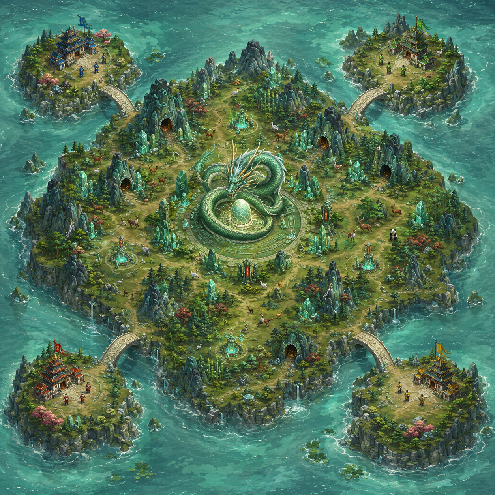
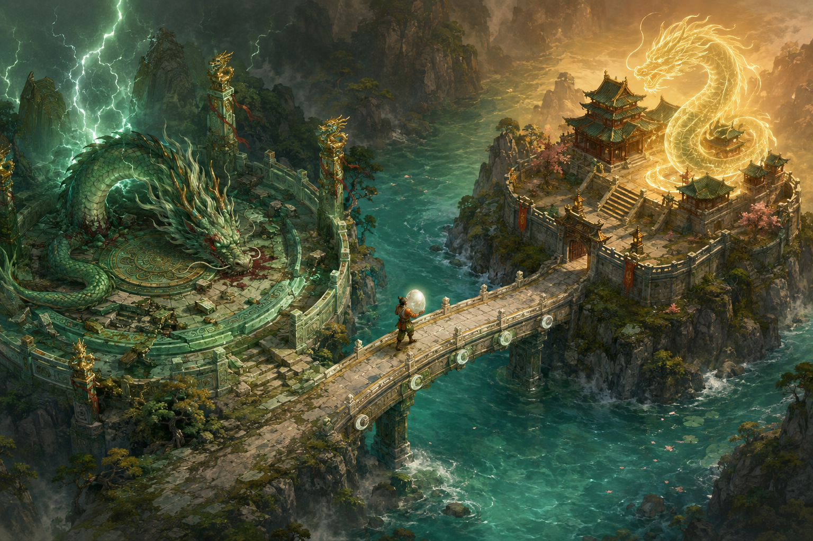
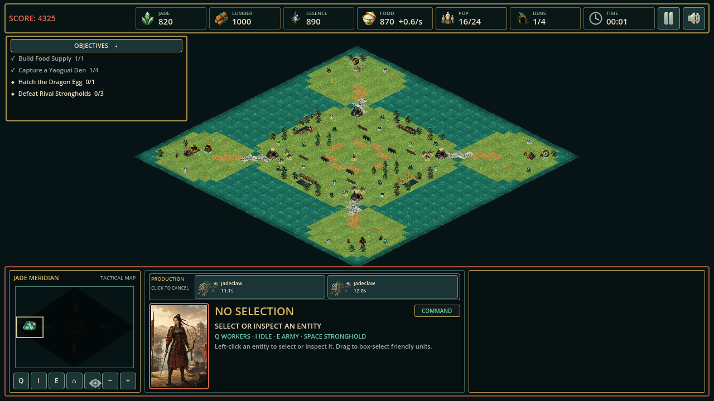
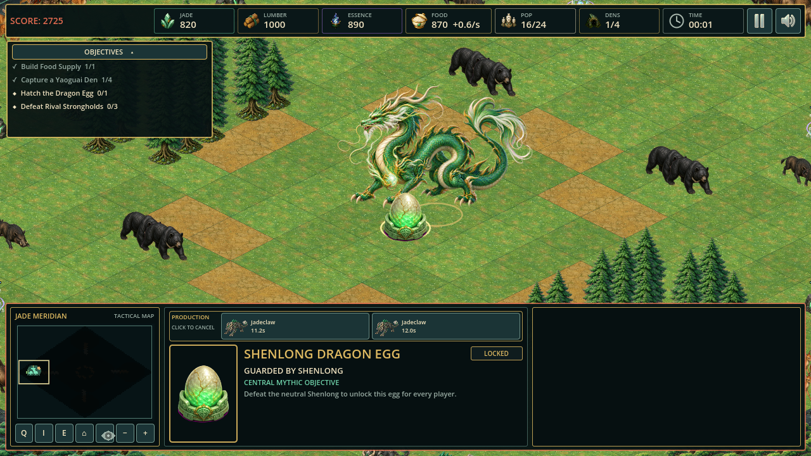
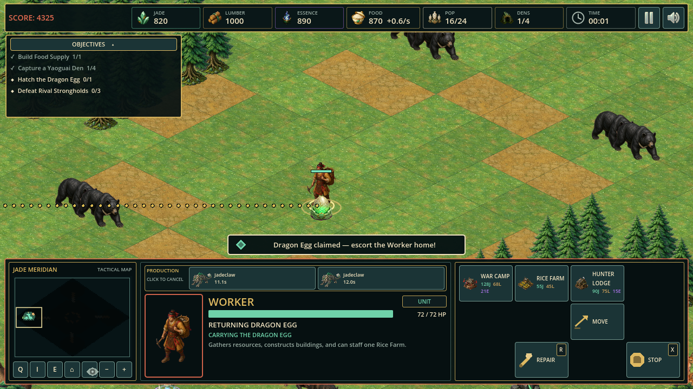

# Four-Player Archipelago Map Overhaul

## Proposal

The new battlefield is **The Fourfold Mandate**, an 80 × 80 four-player archipelago built around a simple strategic promise: each ruler begins safe but resource-poor on a corner island, and every path to long-term power crosses one exposed Moon Bridge into a rich central continent.



Each corner island contains one Stronghold, three Workers, a legal War Camp site, a modest Jade source, an Essence shrine, and a small amount of harvestable woodland. This is enough to establish an economy, but not enough to turtle indefinitely. Each island has exactly one two-cell-wide bridge route to the continent, creating a defensible threshold without allowing a player to seal the route with construction because bridge and road cells remain non-buildable.

The central continent is substantially larger than any starting island. Fourfold-symmetric deposits, forests, wildlife herds, and four Yaoguai Dens give every corner equivalent first access while producing multiple contestable expansion directions. A ring of roads and landmark ridges makes the center readable at both battlefield and minimap scale.

## Shenlong objective

At the exact center, a neutral Shenlong guards a visible but locked dragon egg. The objective uses a physical, interruptible ownership loop:

1. Any military force can engage the neutral Shenlong.
2. Defeating it unlocks the egg for all surviving players.
3. An empty-handed Worker must reach and claim the egg.
4. The Worker physically carries it across the map and can be intercepted. If the carrier dies, the egg drops and becomes claimable again.
5. Returning the egg to that Worker’s living Stronghold consumes the egg and hatches one allied Shenlong beside the base.



The allied Shenlong is a high-impact mythic combat unit, not an instant victory condition. It occupies population, can be killed, and uses the same selection, movement, combat, fog, and command rules as the rest of the army. This keeps the match’s decisive objective dramatic without invalidating the primary last-Stronghold-standing rule.

## Match structure and balance

The default skirmish becomes one human player and three AI rivals. All four factions appear exactly once: the human keeps the selected faction, the original one-on-one opponent remains the primary rival for balance compatibility, and the remaining factions fill the other corners. Each AI receives its own island, Stronghold, Workers, economy, fog state, and commander. Every team starts with the same economic state and unit count. The match is a pure free-for-all: there are no alliances, and every surviving faction is hostile to all three others.

- **Opening:** develop the small island, scout the bridge, and decide whether to defend or expand.
- **Midgame:** contest central resources and Yaoguai Dens through four narrow entrances and a broad interior.
- **Objective race:** commit enough force to defeat Shenlong while preserving or stealing a Worker extraction route.
- **Endgame:** eliminate rival Strongholds. Destroying one rival no longer ends the match; victory occurs when the human Stronghold is the only one left.

AI opponents receive no free resources, vision, combat bonuses, or objective ownership. Each AI runs the same gather, build, train, cave-capture, attack, and egg-return commands available to the player.

## Simulation and presentation contract

`scripts/sim/rts_simulation.gd` remains authoritative for team state, elimination, Shenlong health, egg lock/claim/carrier state, Worker orders, drops, hatching, and allied Shenlong spawning. `MapCatalog` owns only authored topology and placements. `FactionCatalog` owns static Shenlong statistics and art resolution.

`Battlefield`, `BattlefieldMinimap`, and `main.gd` project that state. They may expose contextual commands, team colors, sprites, notices, selection details, and objective progress, but they do not award, transfer, hatch, eliminate, or decide victory.

## Detailed implementation plan

```text
proto-rts/
├── README.md
├── assets/
│   ├── source/
│   │   ├── objectives/shenlong_egg.png
│   │   ├── units/neutral_shenlong.png
│   │   └── SHENLONG_GENERATION_PROMPTS.md
│   └── runtime/
│       ├── objectives/shenlong_egg.png
│       ├── units/neutral_shenlong.png
│       ├── asset-report.json
│       └── SHA256SUMS
├── docs/
│   ├── FOUR_PLAYER_MAP_PROPOSAL.md
│   └── four-player-map-concepts/
│       ├── archipelago-map-concept.png
│       ├── shenlong-objective-concept.png
│       └── GENERATION_PROMPTS.md
├── captures/
│   ├── map-overview.png
│   ├── shenlong-objective.png
│   └── dragon-egg-carrier.png
├── scripts/
│   ├── data/
│   │   ├── map_catalog.gd
│   │   └── faction_catalog.gd
│   ├── sim/rts_simulation.gd
│   ├── view/
│   │   ├── battlefield.gd
│   │   └── battlefield_minimap.gd
│   └── main.gd
├── tests/
│   ├── assets_test.gd
│   ├── core_regression_test.gd
│   ├── hud_test.gd
│   ├── map_test.gd
│   ├── performance_test.gd
│   ├── simulation_test.gd
│   ├── visibility_test.gd
│   └── visual_capture.gd
└── tools/process_assets.py
```

1. **Topology and placement:** replace the two-side authored grid with a square fourfold-symmetric grid; validate four isolated island landmasses, four bridge components, one central continent, equal starts, resource symmetry, clear objective footprints, and full post-tree connectivity.
2. **Four-team simulation:** create four player states and starts, preserve `TEAM_ENEMY` as the first-rival compatibility alias, make cave capture iterate every team, and resolve Stronghold destruction as elimination until only one Stronghold remains.
3. **Objective state machine:** spawn a neutral Shenlong plus locked egg, unlock on guardian death, add Worker claim/return orders, keep the egg attached to its carrier, drop it on death or base loss, and hatch an allied Shenlong at a valid base-adjacent cell.
4. **AI:** retain the existing first-rival behavior and run the same team-parameterized economy, training, cave, hunt, assault, and Shenlong decisions for the other two rivals.
5. **Presentation:** add generated sprites, four team colors, minimap markers, contextual right-click/cursor behavior, carrier iconography, selection details, objective copy, and multi-rival result text.
6. **Verification:** extend map, asset, visibility, simulation, and interaction expectations; run `tools/run_tests.sh`; run the native visual harness once; inspect the map overview and Shenlong objective captures at original resolution.

## Acceptance criteria

- Four Strongholds and twelve starting Workers spawn on four separate corner islands.
- Removing bridge cells disconnects each island; with bridges present all four starts reach the center.
- Exactly four bridge components connect the islands to the sole central continent.
- Central resources, wildlife, and four Yaoguai Dens are fourfold balanced.
- All non-player teams use independent fog and are mutually hostile.
- Destroying one AI Stronghold does not end the match; destroying all three produces victory; losing the human Stronghold produces defeat.
- Shenlong death unlocks exactly one egg. One Worker can claim it, carriers drop it on death, and delivery hatches exactly one allied Shenlong.
- Generated runtime art is derived only through `tools/process_assets.py`, and the asset report and checksums include both new assets.
- The focused automated suite and one native visual-harness run pass.

## Implemented result

The completed native overview shows all four island starts, the four single bridge approaches, the central resource continent, and the four Yaoguai Dens in one frame.



The center objective is rendered as a locked egg with a dedicated selection state beneath the neutral Shenlong guardian.



After the guardian falls, the egg attaches to its Worker carrier, the HUD reports the return order, and the world path leads back toward the owning Stronghold.


