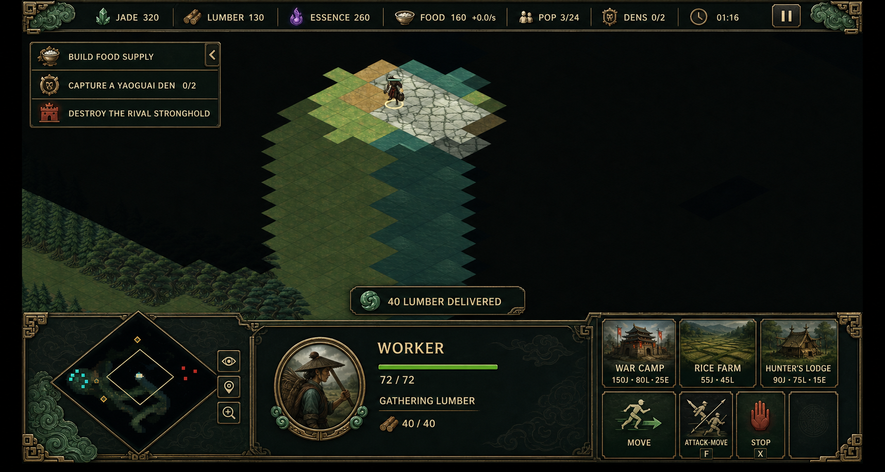
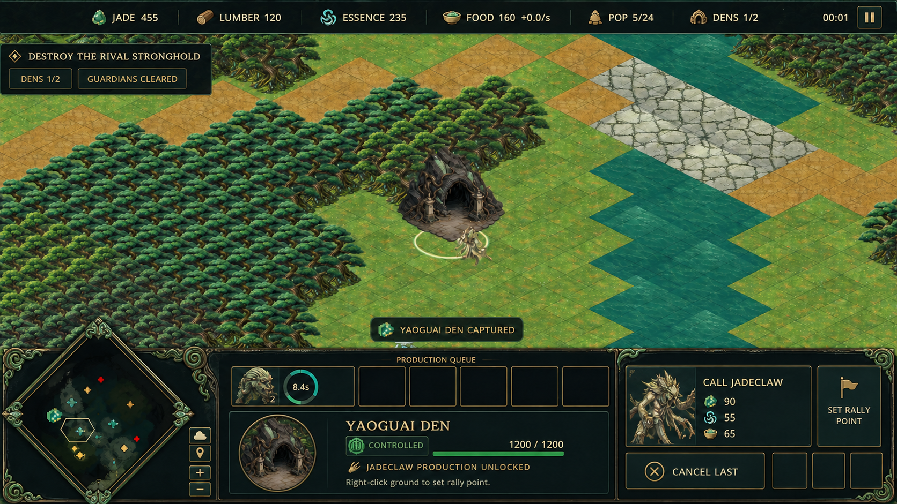
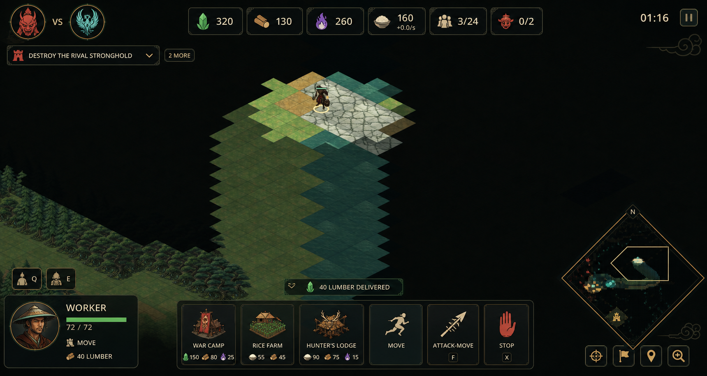

# Mandate of Myth HUD Revamp

**Status:** Concept proposal

**Date:** 2 September 2026

**Target:** Godot 4.7.2, desktop browsers, keyboard and mouse

**Recommendation:** Adopt **Jade Command Altar** as the default HUD; retain **Floating Meridian** as a later compact-mode option.

## Executive direction

The current HUD is functional and readable, but it presents most information as text inside similarly styled rectangles. That makes the interface feel like a developer overlay rather than the command surface of a mythic army. It also gives permanent screen space to low-frequency information while compressing high-frequency information—selection state, orders, costs, queues, and map events—into prose.

The revamp should preserve the proven RTS information triangle:

1. **Economy at the top**, where values remain stable and easy to scan.
2. **Minimap, selection, and commands in one bottom deck**, where the player's eyes and mouse already travel during unit control.
3. **Objectives and alerts as progressive disclosure**, visible when relevant and compact when understood.

The recommended visual identity is a restrained mythic-Chinese command altar: smoked lacquer, carved jade edge pieces, aged bronze fittings, ivory typography, subtle ink-cloud motifs, and faction tint at the perimeter. Decoration must live around information rather than behind it. The result should feel authored for *Mandate of Myth* without copying any competitor's frame art or icon language.



The image is a visual target, not a pixel specification. Final layout, text, hotkeys, state logic, and accessibility must remain deterministic Godot UI.

## Current HUD audit

### What already works

- All strategic currencies, Food income, population, den control, match time, and pause state are always visible.
- Selection text reflects units, structures, resources, queues, worker cargo, construction, food timing, and Yaoguai Den ownership.
- Command buttons are contextual and already distinguish unavailable actions with disabled states.
- The minimap supports click-and-drag camera movement and fog-aware rendering.
- The dark ink, parchment, jade, gold, and danger palette is coherent with the rest of the project.
- Feedback is transient instead of becoming an ever-growing message log.

### Main usability problems

| Problem | Current effect | Revamp response |
| --- | --- | --- |
| Every top-bar datum is plain text | Labels and values blend together; resource recognition requires reading | Give each resource a stable icon, aligned tabular number, and independent pulse state |
| The objective is a permanent paragraph | Repeated instructions occupy a prime corner after the player understands them | Convert it to three terse checklist rows and allow collapse to one active objective |
| Selection state is prose-heavy | Health, order, cargo, construction, capture, and queues cannot be read preattentively | Use bars, badges, progress rings, portraits, and short labels; keep prose in tooltips |
| Commands are large text buttons | Costs use letter abbreviations, commands lack strong silhouettes, and buttons read slowly | Use illustrated command tiles with icon costs, persistent hotkey badges, and short unavailable reasons |
| The minimap is visually isolated at top-right | Map reading and command selection require large eye movements | Move the minimap into the bottom deck beside selection and commands |
| The fog toggle consumes a full button row | A low-frequency utility receives more weight than production state | Reduce it to a small utility button or move it into pause/settings |
| Queue state lives inside selection text | The player sees production only after selecting and reading the producer | Add a compact queue strip with icon, time, stack, producer focus, and cancellation |
| Multi-selection is a count sentence | Composition is visible, but individual health and sub-selection are not | Show a compact unit grid with type stacks, health condition, and click-to-focus behavior |
| One visual treatment covers all urgency | Resource counts, under-attack alerts, objectives, and flavor copy compete equally | Establish four layers: persistent, contextual, transient, and modal |
| Much of the layout is fixed-size | The logical 1280×720 target works, but wide screens do not use added space gracefully | Rebuild with containers, minimums, and explicit compact/full breakpoints |

At the logical 1280×720 capture size, the top bar is roughly 52 pixels high and the bottom deck roughly 141 pixels high. The bottom deck already spends close to one fifth of the screen height, but it does not yet return enough at-a-glance information for that cost. The redesign should keep a similar vertical budget and dramatically improve its information density.

## Competitor analysis

### Warcraft III: The Frozen Throne

*The Frozen Throne* extends the established *Warcraft III* interface: resources and upkeep remain in the top band, while the bottom frame gives stable homes to the minimap, selected-unit or hero identity, inventory, and a contextual command card. A Warcraft III research screenshot clearly shows this left-to-right structure and the hero's health, mana, inventory, and abilities in one cohesive frame. The official manual establishes the underlying interaction and information model. ([official Warcraft III manual](https://ftp.blizzard.com/pub/misc/Warcraft%20III%20Manual.pdf), [WPI interface research screenshot](https://web.cs.wpi.edu/~claypool/mqp/war3/mqp.pdf))

**Why it works**

- The layout never changes its basic geography, so players build strong spatial memory.
- Portraits and faction-specific framing make selection feel like commanding characters, not inspecting database rows.
- Inventory, abilities, health, and mana are shown as distinct visual objects rather than one paragraph.
- Command icons support fast recognition while tooltips carry the detail.

**What to borrow**

- A stable minimap → selection → command-card reading order.
- Strong selection identity, especially for unique structures and Jadeclaws.
- Ornament that sells the world at the outer frame.
- A command card whose slots remain spatially consistent across selections.

**What to avoid**

- A deep 4:3-era frame that permanently removes too much battlefield.
- Decorative texture behind small data.
- Empty inventory or ability furniture for a game with a deliberately compact roster.

### StarCraft and Brood War

The original *StarCraft* manual explicitly divides the command console into the minimap, portrait, status display, resources, and command buttons. That separation is one reason the interface remains legible under high action: each question has one location—“where?”, “what is selected?”, and “what can it do?”. ([official StarCraft manual](https://ftp.blizzard.com/pub/misc/StarCraft.PDF))

**Why it works**

- The console behaves like a cockpit with invariant zones.
- Selection identity and command availability change without moving their containers.
- Race-themed frames create personality while preserving the same underlying interaction model.
- Commands use repeatable icon positions, supporting muscle memory at speed.

**What to borrow**

- Keep selection and action areas adjacent.
- Keep button position stable even when the visual icon changes.
- Let faction identity tint or skin the frame, never move essential controls.
- Make the minimap a first-class command surface instead of a small status preview.

**What to avoid**

- Tiny wireframes and cryptic 1998-scale icons.
- Relying on color alone for health or faction state.
- Reproducing the heavy mechanical-console look, which conflicts with the mythic setting.

### StarCraft II

*StarCraft II* kept the same basic spatial model and added better onboarding controls. Blizzard added a simplified command card, always-visible worker status, current-order indicators, team-colored life bars, and consolidated army/worker utility buttons above the minimap. It also exposed hotkeys on the command card as a permanent option. ([Blizzard patch 2.0.4 notes](https://news.blizzard.com/en-us/article/8724162/starcraft-ii-wings-of-liberty-patch-2-0-4), [Blizzard patch 3.0 notes](https://news.blizzard.com/en-gb/article/19913940/heart-of-the-swarm-3-0-patch-notes))

**Why it works**

- It treats command confirmation, worker status, health display, and hotkey discovery as parts of the core HUD rather than tutorial-only features.
- A simple command-card option lowers first-match complexity without changing the underlying game.
- Utility shortcuts live next to the minimap, close to macro-oriented attention.

**What to borrow**

- Always show the actual bound hotkey on actionable commands.
- Show the selected unit's current order as a status, not explanatory copy.
- Pair world-space order feedback with HUD feedback.
- Keep worker and army selection shortcuts visible but visually secondary.
- Consider a full/compact HUD setting after the default layout is proven.

**What to avoid**

- A large animated portrait or 3D console that spends web-rendering budget without improving decisions.
- Filling all command slots just because the grid has capacity.

### Age of Empires IV

*Age of Empires IV* is especially useful for economy and production information. Its Global Build Queue provides an overview of all queued units and upgrades, lets players focus the producing building, and supports cancellation. Official updates also changed minimap icon scale, layering, and color to reduce clutter and made remaining population space clearer. ([Season One update](https://www.ageofempires.com/news/age-of-empires-iv-season-one-update-release-notes/), [Winter 2021 update](https://www.ageofempires.com/news/age-of-empires-iv-winter2021-update/))

**Why it works**

- Production is treated as global strategic state, not information hidden inside one selected building.
- Minimap symbols are prioritized by importance rather than drawn at equal weight.
- Queue tiles double as navigation, reducing the cost of finding producers.
- Strong-contrast and remappable-control work recognizes that RTS readability is an accessibility requirement.

**What to borrow**

- A short global queue strip with progress and producer focus.
- Minimap layer priority: active threats above allies, objectives above resources, resources above terrain.
- Display remaining population capacity as clearly as the current/maximum pair.
- Provide interface scale and strong-contrast options.

**What to avoid**

- Importing a full worker-allocation or technology interface that the current simulation does not need.
- Letting a global queue become a second command card.

### Command & Conquer Remastered

The *Command & Conquer* sidebar is a useful contrasting model: radar, repair/sell modes, resource state, production categories, build progress, and deployment live in one persistent vertical surface. The official guide describes the sidebar as the game's production and mode hub. ([EA interface guide](https://help.ea.com/en/articles/command-and-conquer/command-and-conquer-remastered/how-to-play/))

**Why it works**

- Macro production is available without first selecting an individual structure.
- Repair and sell are explicit modes with clear cancellation behavior.
- Build progress remains visible while the player moves around the map.

**What to borrow**

- Strong visual treatment for an armed mode such as repair, attack-move, patrol, or structure placement.
- Persistent progress and a direct cancel affordance.

**What to avoid**

- A full-height sidebar; it would reduce horizontal battlefield space and is excessive for this compact production graph.
- Global production that bypasses the existing selected-structure command model.

## Design principles

1. **One question, one home.** Economy is top; place is map; identity and state are center-bottom; action is bottom-right; objectives are top-left; alerts float above the deck.
2. **Recognize before reading.** Icons, bars, progress rings, shape, and position do the first-pass work. Text confirms meaning.
3. **Battlefield first.** Keep the center and lower-center world unobstructed except for short-lived toasts.
4. **Progressive disclosure.** The HUD shows the result or current state; tooltips explain rules and costs.
5. **Stable geometry.** Contents change, but panel locations and command-slot positions do not.
6. **Semantic color is independent of faction color.** Red remains danger, green remains health/ready, purple remains Essence, and gold remains objective/value. Faction accent stays on frame edges, seals, and selection highlights.
7. **No UI-owned gameplay truth.** Every resource, order, queue, health value, cave state, capture timer, and outcome remains authoritative in `scripts/sim/rts_simulation.gd`. The HUD only presents state and invokes commands.

## Recommended concept: Jade Command Altar

### Layout at 1280×720

| Region | Suggested logical size | Content |
| --- | ---: | --- |
| Economy ribbon | 48 px high, full width | Resource chips, population, dens, timer, pause |
| Objective tracker | 300–330 × 44–132 px | One collapsed objective or three checklist rows |
| Alert lane | Up to 420 × 40 px above the deck | One primary toast plus a short queued stack |
| Bottom deck | 156–168 px high | Minimap, selection/status, production queue, command card |
| Minimap bay | 220 × 144 px | Map, camera outline, alerts, compact utilities |
| Command card | 288–312 px wide | 3 × 3 invariant slots with icon, cost, hotkey, state |

The deck may grow modestly on 1080p and larger displays, but its information should scale—not its ornament. At 1024–1279 logical pixels, shorten labels, reduce portrait size, and collapse objectives. Below 1024 logical pixels, show a supported-resolution message or an explicitly designed compact layout rather than allowing arbitrary wrapping.

### Top economy ribbon

- Use one original pictogram per resource with its numeric value aligned on a common baseline.
- Keep labels visible at the default scale; remove labels before shrinking numerals.
- Flash only the changed value for 500–700 ms: jade for income, ivory for normal spend, cinnabar for a failed affordability check.
- Food shows stock plus income on a quieter second line or suffix; do not let `+0.0/s` dominate the stock value.
- Population gains an amber warning at two remaining slots and a red cap treatment at zero remaining slots.
- Den control uses a crest and `owned / total`; when contested, the crest pulses and the minimap marker echoes the same shape.
- Pause is an icon button with a clear tooltip; the paused state should use a centered modal label rather than changing the entire ribbon copy.

### Objective tracker

Default first-match expansion:

- Build Food Supply
- Capture a Yaoguai Den `0 / 2`
- Destroy the Rival Stronghold

After the player manually collapses it—or after a completed onboarding match—the tracker shows only the next relevant objective and a `2 more` badge. Completed rows receive a check seal and reduce contrast; they do not disappear immediately. Den capture progress appears here only when the player is actively contesting one; the detailed timer remains in the selected-den card and world-space ring.

### Minimap bay

- Increase the effective map area and remove the dedicated title and full-width fog button.
- Preserve click and drag camera recentering.
- Draw threats above friendly units, friendly units above objectives, objectives above resources, and resources above terrain.
- Use both color and shape: red chevrons for enemies, cyan circles for allies, gold diamonds for dens, pale squares for structures.
- Keep the camera boundary at least 2 px and bright enough to survive dark fog regions.
- Under-attack locations flash three times and then leave a small decaying marker.
- Fog, ping, and map zoom are 32–36 px utility buttons on the outer edge. If fog toggling is a debug or accessibility feature rather than intended match play, move it to pause/settings for release.

### Selection and status bay

**Single unit**

- Portrait or sprite medallion, display name, faction seal, health bar and numeric health.
- One short current-order label: `Idle`, `Moving`, `Gathering Lumber`, `Returning`, `Repairing`, `Patrolling`, or `Attack-Moving`.
- Worker cargo uses a resource icon and `carried / capacity`.
- Combat units show damage, range class, movement state, and queued-order count without prose.

**Multiple units**

- Replace the count sentence with a compact selection grid.
- Stack identical unit kinds and show a count badge.
- Use a thin health-condition strip per stack: healthy, wounded, critical.
- Click a stack to sub-select that type; double-click or a focus affordance centers it if supported.
- Keep shared orders in the command card and show `Mixed orders` only when necessary.

**Structure**

- Show health, construction completion, rally state, and producer status.
- Queue appears as visual tiles with progress, count, and cancellation.
- Food buildings show `+8 every 4s` or `+18 every 5s` and a next-harvest ring.

**Resource**

- Show the resource icon, remaining amount, and number of assigned visible workers derived from simulation orders.
- Put gathering instructions in the tooltip or empty-state hint, not the permanent card.

**Yaoguai Den**

- Guardian count, ownership seal, capture/contest progress, health, rally state, and Jadeclaw queue each receive separate visual rows.
- Neutral, capturing, controlled, and rival-controlled states use both wording and crest shape.
- Contested capture receives an amber/red segmented ring, not only a sentence.



### Production queue

- Show up to five global queue tiles above the selection card; combine identical consecutive items with a count.
- Each tile contains the unit icon, remaining time or progress ring, and producing-structure accent.
- Clicking selects the producer; a second click centers it.
- Cancellation must invoke the authoritative simulation command and display the actual refund result.
- Queue visibility can later offer `All`, `Selected`, and `Hidden`; the first implementation should use `All` because the roster and producer count are small.

### Command card

- Use a 3 × 3 grid with stable slot semantics.
- Reserve common order locations across units: Move, Attack-Move, Patrol, Stop, Repair when applicable, and Cancel Last where applicable.
- Put build/train actions in consistent leading slots.
- Show the actual bound key from the project's input mapping. Never bake decorative letters into source art.
- Costs use small resource icons plus numbers. On failure, highlight only the missing resource and show `Need 15 Lumber` in the tooltip.
- Disabled buttons keep their silhouette and label at readable contrast; use desaturation and a lock/shortfall overlay rather than opacity alone.
- Placement or armed-command modes use a bright jade outer keyline, cursor/world confirmation, and an explicit `Esc Cancel` strip.
- Empty slots remain quiet; do not fill them with ornamental stamps that resemble buttons.

### Alerts and feedback

Four tiers prevent alert fatigue:

1. **Critical:** stronghold under attack, population capped during production, den being seized. Cinnabar edge, sound, minimap ping, up to 4 seconds.
2. **Actionable:** idle workers, queue blocked, insufficient resource, invalid placement. Amber edge, optional shortcut, 3 seconds.
3. **Positive:** resources delivered, unit trained, den captured. Jade edge, 2 seconds.
4. **Informational:** fog toggled, selection shortcut used, command cancelled. Ivory edge, 1.5–2 seconds.

Show at most one expanded toast and two collapsed icons. Repeated resource deliveries aggregate rather than spam. Critical alerts may replace lower-priority toasts; nothing should cover the active command card.

## Alternative concept: Floating Meridian



This variation breaks the bottom deck into translucent islands: selection at bottom-left, commands at bottom-center, and minimap at bottom-right. It exposes more world art and looks lighter in screenshots.

| Dimension | Jade Command Altar | Floating Meridian |
| --- | --- | --- |
| Glance path | Short; map, state, and actions form one band | Longer; attention crosses both bottom corners |
| Battlefield visibility | Good | Excellent |
| Brand presence | Strong and cohesive | Restrained and modern |
| Dense selection/queue states | Easier to support | More likely to expand awkwardly |
| Contrast over bright terrain | Predictable opaque deck | Requires careful local backplates |
| Implementation risk | Moderate | Moderate-high due to collision and safe-area logic |
| Recommendation | Default | Optional compact or screenshot mode after launch |

Floating Meridian should not be the initial implementation. Its strengths are real, but the game's browser target and information-rich den/economy states benefit more from the predictable contrast and stable geometry of Jade Command Altar.

## Visual system

### Core palette

| Token | Suggested color | Use |
| --- | --- | --- |
| Ink | `#071012` | Deep background and fog-adjacent panel base |
| Lacquer | `#0D1C1B` | Primary panel surface |
| Lacquer raised | `#162B29` | Hovered or elevated surfaces |
| Jade | `#63C8A4` | Positive state, active selection, ready progress |
| Celestial cyan | `#74D7D0` | Existing Celestial accent and friendly map marks |
| Gold | `#D9B45E` | Objective, value, and outer trim |
| Ivory | `#F0E2C0` | Primary text and numerals |
| Muted sage | `#9AADA4` | Secondary labels |
| Cinnabar | `#D95645` | Danger, enemy, invalid, destructive action |
| Essence violet | `#A974E6` | Essence icon and spend feedback |

Faction colors from `FactionCatalog` should bind to frame seals, portrait rings, and selection accents. They must not replace the semantic colors above.

### Type and spacing

- Use a compact humanist sans-serif with open counters and tabular numerals.
- Suggested logical sizes at 1280×720: 20–22 px selection name, 16–18 px resource value, 14–16 px command label, 13–14 px secondary status. Avoid essential text below 13 px.
- Use an 8 px spacing unit: 8 internal gap, 16 normal padding, 24 major separation.
- Keep clickable targets at least 44 × 44 logical pixels.
- Use all caps for short commands and resource labels, not for explanatory sentences.

### Surface and motion

- Keep primary panels 92–97% opaque and floating panels 78–88% opaque, depending on background.
- Use 1 px normal borders, 2 px active/focus borders, and restrained outer glows.
- Decorative cloud lines should stay below 8% contrast and outside text areas.
- Hover/press transitions: 80–120 ms. Panel expansion: 140–180 ms. Critical pulse: no faster than 500 ms.
- Provide reduced-motion mode that replaces pulse and slide with a static highlight.

## Accessibility and browser requirements

- Interface scale presets: 90%, 100%, 110%, 125%; default 100% at logical 1280×720.
- Strong-contrast mode raises panel opacity, removes decorative texture behind data, and thickens minimap markers.
- Colorblind-safe map marker shapes and optional player-color overrides.
- Keyboard focus uses a 2 px ivory/gold outline that is visually distinct from hover.
- Every icon-only utility has a tooltip and accessible text name.
- Health, capture, construction, food harvest, and queue progress include numeric text or state wording.
- Resource shortage uses icon, number, and wording—not red alone.
- Respect the current single-threaded web target: avoid shaders, live blur, and animated 3D portraits in the HUD.

## Godot implementation shape

The UI should be decomposed without weakening the simulation/view contract:

```text
main.gd
└── HudRoot (presentation orchestration only)
    ├── EconomyRibbon
    ├── ObjectiveTracker
    ├── AlertLane
    └── CommandDeck
        ├── MinimapBay -> BattlefieldMinimap
        ├── SelectionBay
        ├── ProductionQueue
        └── CommandCard
```

Suggested responsibilities:

- `scripts/sim/rts_simulation.gd`: gameplay truth, authoritative command validation, resource spend/refund, orders, queues, capture, outcomes.
- `scripts/view/battlefield.gd`: selection, world input interpretation, placement/armed-command presentation, order markers, camera.
- `scripts/view/battlefield_minimap.gd`: map projection, fog-aware marks, alerts, camera boundary, map input.
- `scripts/ui/hud_root.gd`: subscribe to selection and battle events, read state, coordinate child presentation, own UI-only collapse/scale settings.
- `scripts/ui/*_panel.gd`: render a supplied view model and emit user intent; never mutate entity dictionaries directly.
- `scripts/ui/theme_factory.gd`: tokens, component styles, focus states, spacing, and faction skin hooks.

Global queue display can be derived by reading living player-owned structures and their authoritative `queue` arrays. That aggregation is presentation state. Cancellation, resource refunds, and population release remain simulation commands.

Avoid hard-coded positions for the new deck. Use `MarginContainer`, `HBoxContainer`, `VBoxContainer`, `GridContainer`, minimum sizes, and controlled stretch ratios. Absolute positioning should be limited to the overlay root, alert lane, and intentional world-adjacent effects.

## Delivery plan

| Phase | Scope | Complexity | Verification |
| --- | --- | --- | --- |
| 1. Structure | Extract HUD nodes, build responsive containers, preserve current text/actions | Medium | `tools/run_tests.sh`; native visual harness once |
| 2. Information | Resource chips, compact objectives, visual selection states, command-card slots and costs | Medium | Interaction tests plus 1280×720 capture review |
| 3. Queue and modes | Global queue, cancellation, patrol/repair/placement armed states, alert priority | Medium-high | Simulation tests for commands/refunds; visual harness |
| 4. Art pass | Generate original HUD icons/medallions, add source masters, extend asset processing | Medium | Run `tools/process_assets.py`; verify asset report and checksums; asset tests |
| 5. Accessibility | Scale presets, strong contrast, marker shapes, reduced motion, keyboard focus | Medium | Captures at all scale presets and keyboard-only smoke test |
| 6. Polish | Faction edge skins, sound cues, short motion, compact-mode feasibility | Low-medium | Native visual harness and one final browser export if release-bound |

Phase 1 should intentionally preserve behavior. Visual redesign and behavior expansion are easier to review when not mixed into one large change.

## Acceptance criteria

- At 1280×720, no essential label is smaller than 13 logical pixels and no actionable target is smaller than 44 × 44.
- Resource values, population pressure, den ownership, timer, current selection health/order, and available commands are identifiable without reading paragraph text.
- The objective tracker collapses and never exceeds three short rows.
- Single unit, multi-unit, structure, resource, neutral den, contested den, owned den, placement, paused, victory, and defeat states have deliberate layouts.
- All command buttons display their real current binding or no badge; art contains no baked hotkey letters.
- Disabled actions identify the missing resource, Food, population, ownership, or construction condition.
- Queue progress and cancellation reflect authoritative simulation state.
- The minimap retains click/drag navigation and remains readable with fog enabled.
- Strong-contrast mode and 125% scale remain usable at 1280×720.
- No HUD code owns resource totals, entity health, queue truth, capture truth, or outcomes.
- Runtime HUD art is created only as a derivative through `tools/process_assets.py`, with `asset-report.json` and `SHA256SUMS` updated.

## Success checks with players

Run five short first-match tasks with at least three people unfamiliar with the prototype:

1. Identify which resource blocks a Hunter's Lodge.
2. Select all workers and find one carrying a resource.
3. Start a unit, find its remaining production time, then cancel it.
4. Determine whether a den is guarded, being captured, contested, or controlled.
5. Respond to a stronghold-under-attack alert using the minimap.

Record time-to-correct-answer and misclicks. The target is that every task can be completed without opening help and that no participant mistakes decorative furniture for a control.

## Source notes

The competitor references establish reusable interaction patterns, not an art brief. All frame shapes, icons, textures, crests, portraits, and motion for *Mandate of Myth* should remain original. The generated concepts were produced with GPT Image 2 through the built-in image workflow; prompts are preserved in [`hud-concepts/GENERATION_PROMPTS.md`](hud-concepts/GENERATION_PROMPTS.md).
