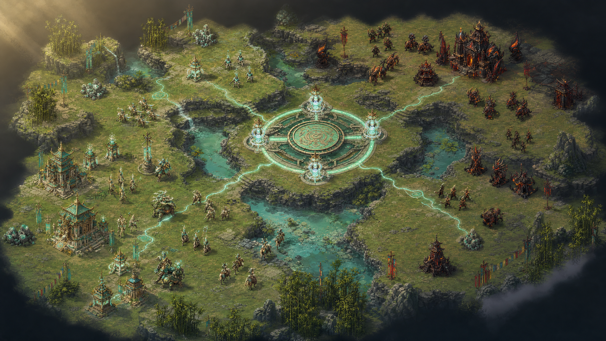
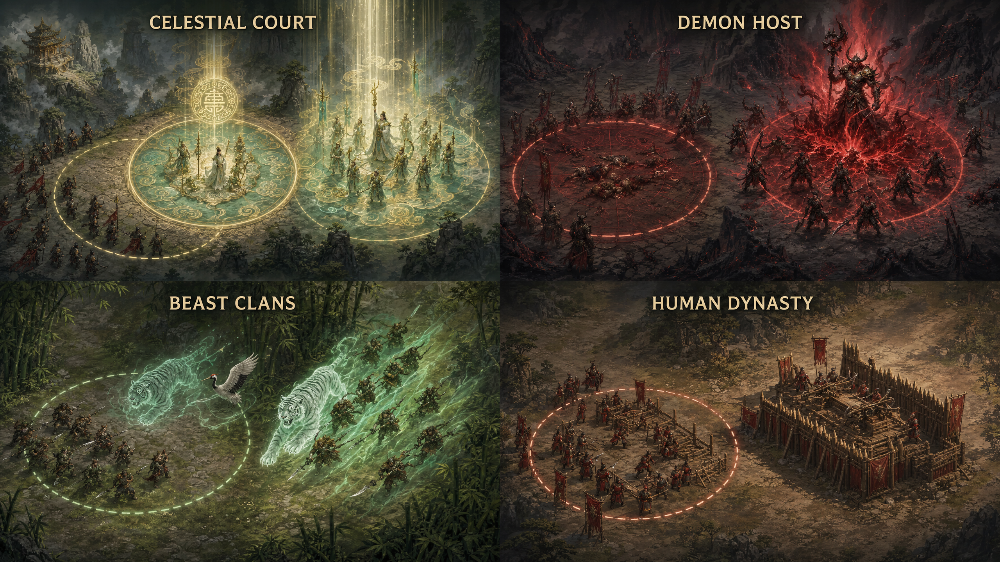
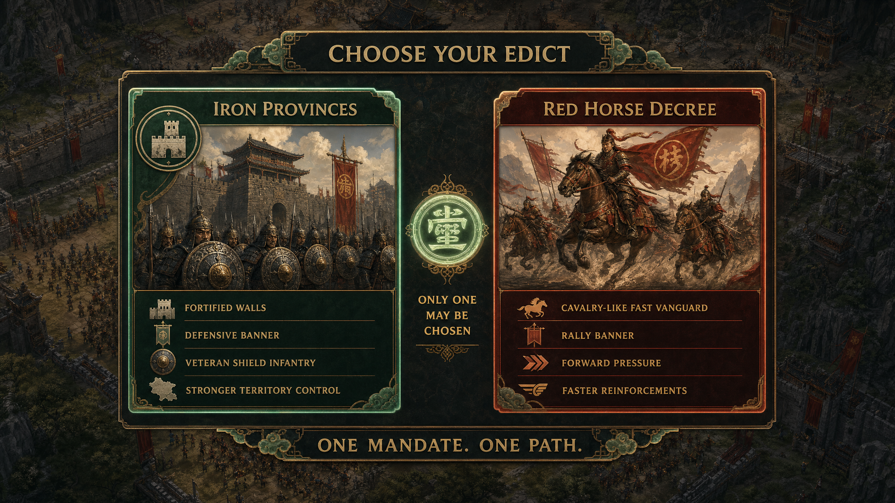
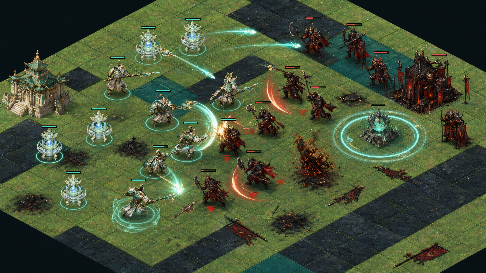
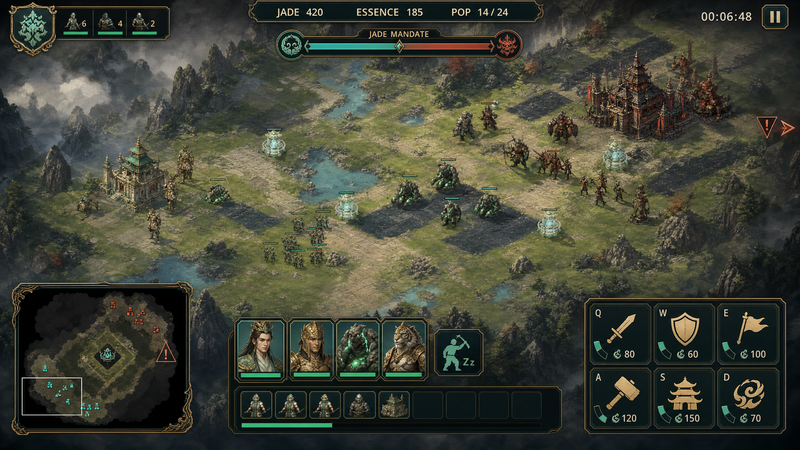

# Mandate of Myth: Current-State Analysis and Feature Proposal

**Author:** Manus AI

**Date:** 2 September 2026

**Audited revision:** `7f012465f2c8d6cb6cfab4985b786c30c9f4ccbb`

**Target:** Godot 4.7.2, desktop browsers, keyboard and mouse

## Executive Recommendation

**Mandate of Myth already has a sound vertical-slice foundation.** The repository contains a complete 1v1 skirmish loop, a deterministic 30 Hz simulation, two-resource gathering, construction, production queues, pathfinding, formation destinations, combat, four visual factions, a scripted opponent, victory and defeat, a polished title flow, and a working web export. The architecture correctly treats simulation coordinates as authoritative and keeps projection, camera, rendering, and interface feedback in the view layer.[1] [2] [3]

The main limitation is not missing breadth. It is that the current match offers too few consequential decisions. The player gathers from safe nearby nodes, builds one production structure, trains one of two combat units, and destroys one building. The factions mostly alter numeric passives. The enemy follows one production-and-attack script. The central map has no objective, fog of war, vision game, tech fork, expansion decision, or alternate tactical route with a distinct payoff. The result is functional RTS grammar without enough conflict generators.

> **Recommended product direction:** Turn the **Jade Meridian** into the match’s central, contestable power source. Holding it should charge a faction-specific **Mandate power**, not grant an immediate snowballing stat bonus. Support that loop with one additional combat role, fog of war, readable command feedback, a fair objective-aware AI, and a layered audiovisual feedback system.

This direction closes the largest gap between the game’s striking mythic presentation and its modest battlefield expression. It also follows the most consistent finding across fifteen successful and instructive RTS benchmarks: **players return when economy, information, map control, and combat form a short causal loop, and when they can immediately understand why an action succeeded or failed.**

The next version should not attempt a campaign, online matchmaking, four fully unique technology trees, heroes, naval combat, procedural maps, or a large roster. Those are reinforcements for a war not yet underway. The prototype first needs one superb match.

## 1. Scope and Method

The analysis combined five forms of evidence. First, the repository’s design documents, data catalogs, simulation, battlefield view, interface, tests, project configuration, and web export were inspected. Second, the three committed reference captures were reviewed at 1280 × 720. Third, the published GitHub Pages build was loaded in a browser and checked for canvas behavior and runtime errors. Fourth, the focused Godot suite was run with Godot 4.7.2 on Linux after priming the project import cache. Fifth, fifteen RTS games were benchmarked through official documentation, patch notes, professional reviews, storefront metadata, and carefully qualified community sentiment.

The benchmark deliberately spans competitive base-building, tactical territory control, large-scale macro, survival defense, RTS/4X hybrids, remasters, community projects, and recent releases. This prevents the proposal from becoming a tribute to one genre lineage.

## 2. Current Implementation

### 2.1 Playable Loop

A player selects one of four factions, enters a single fixed map with a Stronghold and three Workers, gathers Jade and Essence, constructs a War Camp, queues Vanguards or Mystics, and attacks the opposing Stronghold. The opponent begins with its own Stronghold, Workers, and a completed War Camp. It receives periodic Jade and Essence, produces mixed forces, and sends an army to the player’s Stronghold after reaching a count or timer threshold.[1] [2]

The implemented control model includes click selection, drag selection, contextual right-click commands, rally points, attack-move, stop, worker and army selection shortcuts, Stronghold centering, camera panning, zoom, pause, and rematch. The interface exposes resources, population, match time, selected-unit details, structure queues, contextual production buttons, and textual feedback.[1] [3] [4]

| System | Current implementation | Assessment |
| --- | --- | --- |
| Economy | Jade and Essence, finite nodes, worker cargo, drop-off, faction income modifiers | Complete foundation, but expansion and resource denial are underdeveloped |
| Construction | One worker-built War Camp with placement validation and construction progress | Reliable vertical slice, but no defensive or economic build choices |
| Production | Worker, Vanguard, and Mystic queues with reserved population | Functional, but the roster produces only a limited composition decision |
| Combat | Melee and ranged damage, cooldowns, pursuit, auto-acquisition, attack-move, faction kill effect | Mechanically complete, but lacks armor, status, tactical terrain, and strong anticipation/impact feedback |
| Navigation | Static A* grid, nearest-walkable search, formation destinations | Appropriate for the current scale, but group behavior and attack-move continuation need correction |
| Factions | Four complete visual sets and one passive package per faction | Excellent presentation leverage, shallow rules-level asymmetry |
| AI | Worker auto-assignment, periodic stipend, fixed mixed production, threshold assault | Capable of producing pressure, not yet capable of scouting, defending, raiding, contesting, or adapting |
| Match structure | One map, one opponent pairing per faction, one Stronghold-destruction victory | Complete but rapidly solved |
| Feedback | Selection rings, bars, flashes, attack beams, command rings, text feedback | Useful minimum, far below the presentation implied by the key art |
| Replay layer | Rematch and faction reselection | No scenarios, difficulty, records, post-match causality, seeds, or progression |

### 2.2 Architecture Strengths

The most important strength is the **authoritative simulation/view split**. `RtsSimulation` owns resources, entities, orders, pathfinding, economy, production, combat, AI, and outcomes. `Battlefield` translates input and renders a projection of that state. `main.gd` owns screens and the heads-up display. This boundary is the correct foundation for deterministic testing, replay recording, alternative views, AI improvements, and future networking work.[1] [2] [3]

The 30 Hz fixed simulation step limits frame-rate-dependent behavior. Isometric projection is isolated and unit tested. Map and faction data are centralized. Generated source assets are separated from optimized runtime derivatives. The web build is intentionally single-threaded, which keeps static hosting straightforward. These are disciplined choices for a browser prototype.[1] [5]

The current generated art is also an asset, not merely decoration. The title screen establishes a distinctive world, and the four faction portraits communicate stronger identity than many prototypes achieve. The next systems should exploit that investment rather than replacing it with a new art direction.

### 2.3 Verification Result

The published GitHub Pages build loaded successfully to the title screen without browser-console errors. The canvas resized to the available browser viewport and letterboxed the fixed 16:9 game view in a taller window. This preserves composition but makes the interface smaller at non-native aspect ratios.

The focused Godot tests passed after the editor completed its first import and global-class scan:

| Gate | Result |
| --- | --- |
| Projection test | Passed |
| Runtime asset test | Passed; all 30 assets resolved |
| Simulation smoke test | Passed; gathering, construction, production, combat, and victory |
| Bounded headless boot | Passed |
| Published web bundle | Loaded successfully; non-empty HTML, JavaScript, PCK, and WASM present |

A fresh command-line clone does not pass `tools/run_tests.sh` immediately because the script assumes the macOS Godot path unless `GODOT_BIN` is supplied and because global `class_name` registration is unavailable until an import/editor scan occurs. The suite itself passes once the environment is initialized. This is a portability defect in the test harness, not a failed gameplay assertion.[7]

## 3. High-Priority Findings

### 3.1 Correctness and Trust

| Priority | Finding | Evidence and player effect | Recommended correction |
| --- | --- | --- | --- |
| **P0** | Attack-move can stop after the first target dies | After an attack-move target disappears, the code searches once. If no enemy is currently in acquisition range, it returns without restoring the original destination path. The unit can remain in `attack_move` with no path and no target.[2] | Store the attack-move destination separately. After each target resolution, reacquire locally or resume the destination path. Add a regression test with a target encountered mid-route. |
| **P0** | Formations collapse above nine units | `_formation_cells` returns at most nine positions. Every additional selected unit receives the final position through `min(index, formation.size() - 1)`, creating stacking and visual/pathing congestion at ordinary army sizes.[2] | Generate concentric Manhattan or spiral rings until the requested count is satisfied. Validate every slot through nearest-walkable search. |
| **P0** | War Camps can be founded on live units | Placement validation checks terrain, structures, and resources, but it excludes units. A new foundation can therefore overlap friendly or enemy units, compounding the absence of dynamic separation.[2] | Reject every live entity whose cell or radius intersects the footprint. Add player-unit, enemy-unit, and moving-unit placement tests. |
| **P0** | Fresh-clone tests are not self-initializing | The runner has a macOS default and does not prime imports/global classes. This blocked the first Linux test attempt even though all assertions passed after import.[7] | Auto-discover Godot, print a clear dependency error, run a bounded headless editor import when `.godot/global_script_class_cache.cfg` is missing, and add CI. |
| **P1** | The documented AI plan differs from code | The implementation plan says the AI builds a War Camp if it has none. The code instead spawns a completed enemy War Camp at setup and never executes AI construction.[2] [6] | Choose an explicit difficulty rule. For the normal mode, remove the free camp and let the AI build it through the same economy. If a head start remains, disclose it numerically. |
| **P1** | Documented local separation is absent | The plan promises lightweight unit separation. Runtime movement only follows paths and allows dynamic overlap; the A* grid does not treat units as obstacles.[2] [6] | Add view-independent local separation or reservation steering with a small capped correction. Test chokepoints and mixed-speed groups. |
| **P1** | Neutral-resource selection details are effectively unreachable | Single-click selection filters to player-owned entities, while the HUD contains a dedicated resource-selection branch.[3] [4] | Permit left-click inspection of neutral resources without making them commandable, or remove the unreachable branch. |
| **P1** | Selection and edge-click state can mislead the player | Dead entity IDs are not pruned from selection, and ordinary right-clicks outside the map are silently clamped to a legal edge cell while reporting success.[2] [3] [4] | Prune dead selections on state changes, require `alive` in selection helpers, and reject or visibly resolve off-map commands before acknowledgement. |

These issues matter because **responsiveness is game juice**. A beautiful hit effect cannot compensate when an attack-move silently loses its destination or twelve units occupy one formation slot.

### 3.2 Strategic Gaps

The map is visible in full from the start. There is therefore no scouting decision, information denial, ambush, watch point, or risk attached to an unseen route. The center contains higher-value resources, but it has no explicit control state and no immediate strategic reward beyond ordinary gathering. A player can ignore the middle until additional income is required.

The unit roster has only two combat roles and no armor or bonus-damage relationships. Vanguards and Mystics differ in durability, movement, range, cadence, and cost, but the game has no full composition triangle. Because there is no fast anti-ranged diver, support unit, siege role, terrain bonus, or ability timing, combat tends toward mass comparison and focus fire.

Faction differentiation is primarily numeric. Celestial receives better Essence and Mystic range. Demon gains kill healing and Essence. Beast gains movement and cheaper Vanguards. Human gains Jade and cheaper War Camps.[5] These bonuses influence efficiency, but they do not change the player’s verbs, opening sequence, map relationship, or tactical expression. The four factions currently feel like **strong visual promises attached to one shared ruleset**.

Terrain currently changes walkability but not combat visibility. Target acquisition scans opposing entities by distance without line-of-sight, path-reachability, or fog checks, so ranged units can theoretically acquire and fire across ridge or water geometry when Euclidean range permits.[2] Fog of war must therefore become a simulation rule that gates information and target acquisition, not merely a dark rendering overlay.

The AI does not scout, infer, defend threatened resources, focus on the player’s economy, retreat, contest the center, change composition, or expose a personality. It receives income, trains an alternating composition, and periodically orders its full army against the Stronghold.[2] This can defeat an inattentive player, but it cannot generate a varied strategic story.

### 3.3 Presentation and Game-Juice Gaps

The title and faction screens are attractive, coherent, and readable. The skirmish screen is much flatter. The terrain reads as a repeated tiled board, generated unit detail collapses at gameplay scale, and the battlefield has no ambient motion, environmental props, fog, spell anticipation, projectile variation, strong death language, or persistent aftermath. The view currently draws health/resource bars, selection ellipses, a red flash, attack lines, and expanding effect rings.[3]

There are no audio streams or music systems in the project. This removes one of the highest-return RTS feedback channels: selection acknowledgement, order confirmation, construction rhythm, weapon identity, under-attack warnings, capture tension, and victory punctuation. Current text feedback is useful, but it cannot carry urgency or physical weight alone.

The bottom command deck occupies a large fixed region even when nothing is selected. There is no minimap, fog state, control-group strip, idle-worker alert, army summary, objective meter, production overview, off-screen danger indicator, or post-match timeline. The objective panel spends scarce screen space explaining the AI stipend rather than telling the player what to contest next.[4]

The battlefield redraws every terrain tile and re-sorts all alive entities every rendered frame.[3] This is acceptable for a 20 × 16 map, but static terrain should be cached before adding larger maps, fog overlays, props, and more units.

### 3.4 Accessibility and Browser Gaps

The interface supports keyboard focus on buttons and presents readable text at the intended 1280 × 720 viewport. However, it has no UI-scale option, colorblind-safe ownership mode, remappable hotkeys, reduced-effects mode, independent alert volume, or text equivalent for future critical audio. The web page exposes only a canvas, so browser automation and assistive DOM technologies cannot inspect in-game controls. A Godot game can still be keyboard-accessible inside the canvas, but accessibility must be implemented deliberately within the game.

The published build uses the default Godot loading presentation. A branded lightweight HTML shell, progress treatment, and minimum-window guidance would create a much stronger first impression. The current uncompressed payload includes a roughly 39.5 MB WebAssembly file and a 4.2 MB PCK. This is reasonable for a Godot web prototype, but compression, cache headers where hosting permits, and asset-budget monitoring should be part of release verification.

The source preset disables Web threading, and the documentation says cross-origin isolation is not required. The committed generated shell nevertheless sets `ensureCrossOriginIsolationHeaders` to `true`. The live page loaded during this audit, so this is not a demonstrated production failure, but the next release should re-export from the reviewed preset and verify that generated shell behavior, hosting headers, and documentation agree.

## 4. RTS Market Research

### 4.1 Benchmark Coverage

| Benchmark | Most transferable lesson | Main caution |
| --- | --- | --- |
| *StarCraft II* | Scouting, counters, clean faction identity, replays, and precise audiovisual state communication produce an enduring mastery loop.[8] [9] | Do not copy its full actions-per-minute burden, knowledge depth, or content scale. |
| *Age of Empires IV* | Economy, age progression, exposed resources, walls, and multiple objectives make map control materially valuable.[10] [11] | Pathfinding, target behavior, and overlarge counter matrices can make intent feel unreliable. |
| *Warcraft III* | Heroes, neutral camps, items, and custom scenarios make the map a progression surface rather than empty transit space.[12] | Hero snowball and missing social/custom features can overwhelm otherwise excellent fundamentals. |
| *Command & Conquer* | Fast production, finite visible resources, faction personality, strong music, and readable weapon feedback create immediate momentum.[13] | Old interface friction and solved rush/spam patterns should not be treated as sacred tradition. |
| *Supreme Commander: Forged Alliance / FAF* | Strategic zoom, reclaim, multi-front pressure, and powerful command tools make macro decisions feel expressive.[14] | Massive scale, economy stacking, long sessions, and late-arriving faction identity are unsuitable prototype targets. |
| *Company of Heroes 3* | Territory, cutoffs, cover, facing, retreat, and veterancy make tactical movement explain the result.[15] [16] | A broad strategic layer adds little if consequences, AI, warnings, and UI state are opaque. |
| *Total War: WARHAMMER III* | Strong fantasy asymmetry and spectacular causal battle states create self-authored stories.[17] | Tooltips, simultaneous crises, and systemic volume can exhaust or confuse new players. |
| *Northgard* | Zone expansion, forecastable survival pressure, worker reassignment, and multiple victories create high decision density at low actions per minute.[18] | Random crises and many resources require excellent forecasting and recovery guidance. |
| *Dune: Spice Wars* | A signature resource, recurring tax clock, territory logistics, politics, and environmental hazards connect economy to theme.[19] | A dozen currencies and weak tactical AI can obscure the central fantasy. |
| *They Are Billions* | Expansion increases both income and exposed perimeter; forecastable waves turn preparation into tension.[20] [21] | Long, irreversible failures and weak onboarding create frustration rather than suspense. |
| *Beyond All Reason* | Terrain, projectile clarity, commander risk, reclaim, and powerful group commands support controlled chaos.[22] | Hundreds of units, giant teams, and external-guide dependence would bury a small project. |
| *Age of Mythology: Retold* | Myth units and reusable god powers differentiate a familiar RTS through high-impact fantasy decisions.[23] | Spectacle, automation, pathfinding, and effect density must remain transparent. |
| *Tempest Rising* | Strong construction/harvesting asymmetry, active unit twists, and classic impact-heavy presentation create a clear market promise.[24] [25] | Thin maps, generic missions, and expensive upgrades can leave strategic depth inaccessible in normal matches. |
| *Stormgate* | Creep camps and radically different production rules can create central fights and faction identity.[26] [27] | Breadth, monetization, and future promises do not rescue a weak first session or muddy combat readability. |
| *Homeworld 3* | Terrain, facing, formations, persistent fleets, and short roguelike challenge runs offer distinctive tactical stories.[28] [29] | Unfamiliar controls, fragile units, repetitive objectives, and noisy feedback can negate the fantasy. |

### 4.2 Cross-Market Conclusions

The research converges on six principles.

**First, identity beats breadth.** The most memorable factions change a verb: how they build, harvest, move, claim territory, summon units, or convert map control into power. A numerical bonus can support identity, but it cannot create it alone.

**Second, the map must generate decisions.** Resources, capture points, neutral camps, cutoffs, salvage, hazards, and vision nodes create reasons to move before a final base assault. A map that only contains paths between safe economies postpones the actual strategy.

**Third, reliable control is part of the fantasy.** Selection, attack-move, formations, target priority, pathfinding, queues, range indicators, and order acknowledgement repeatedly appear in patch notes because they determine whether the player feels like a commander or a technical support specialist.

**Fourth, juice must explain causality.** The strongest feedback systems have a sequence: anticipation, travel, impact, reaction, state change, and aftermath. Constant particles are not juice. They are weather.

**Fifth, onboarding and mastery need separate ramps.** A short playable tutorial, forgiving AI, pause or speed control, focused challenges, post-match explanation, and later replay tools can make a deep game approachable without flattening its ceiling.

**Sixth, scope mismatch destroys trust.** Several recent RTS releases suffered when thin content, unclear value, weak social systems, missing legacy features, technical faults, or a poor first session eclipsed the underlying design. The correct response for this project is a narrow, polished promise.

## 5. Proposed vNext: The War for the Jade Meridian

### 5.1 Product Promise

> **Build a mythic host, contest the living Jade Meridian, invoke your faction’s Mandate, and break the rival Stronghold in a readable 10–14 minute skirmish.**

The revised loop preserves the existing economy and Stronghold victory while adding a central conflict engine:

1. During the opening, the player establishes income, scouts two routes, and chooses an early army composition.
2. The Jade Meridian awakens after a short, clearly announced delay.
3. Units standing uncontested within the Meridian capture radius establish control.
4. Holding the Meridian charges a **Mandate meter**. It does not directly increase ordinary income or combat statistics.
5. At full charge, the holder can spend the meter on a faction-specific active power.
6. The opposing player can interrupt the charge, force a premature cast, raid exposed side resources, or attack the Stronghold while the army is committed centrally.
7. The Stronghold remains the victory condition, preserving the current match conclusion and avoiding an immediate redesign of every system.

This produces a recurring choice between **economy, center control, side-route pressure, and base defense**. Because the objective pays out as a consumable tactical option rather than a permanent passive advantage, it can create dramatic reversals without automatically deciding the match.

*Concept direction: the Jade Meridian becomes a clear center objective with two approaches, side resources, readable faction territories, and fog-darkened boundaries. The elevation and asset density are aspirational; the first implementation can remain on the current flat isometric grid.*

### 5.2 Objective Rules

| Rule | Proposed initial value | Design purpose |
| --- | --- | --- |
| Activation | 75 seconds after match start | Protects the economic opening while creating a visible first deadline |
| Capture | 8 uninterrupted seconds with at least one military unit present | Long enough for counterplay, short enough to avoid dead waiting |
| Contesting | Opposing military pauses progress and slowly pulls control toward neutral | Produces sustained fights rather than instant flips |
| Mandate charge | 1 point per second while held; 100-point cap | Creates an understandable approximately 100-second power cycle |
| Direct income | None | Prevents the objective from compounding army and economy simultaneously |
| Vision reward | A short reveal pulse on capture, then normal unit vision | Makes capture informative without permanent omniscience |
| Power use | Spends the full meter; strong global audio and map cue | Creates a commitment moment and a window for retaliation |

These values are starting hypotheses. Playtests should tune time-to-first-contest, average captures per match, and whether a losing player can reasonably challenge the second power cycle.

### 5.3 Third Combat Role

Add one **Raider** role to complete a readable triangle without expanding the roster excessively.

| Role | Strength | Weakness | Battlefield job |
| --- | --- | --- | --- |
| **Vanguard** | Durable line holder; bonus against Raiders | Slow and vulnerable to sustained Mystic focus | Protect production, anchor captures, screen ranged units |
| **Mystic** | Ranged damage; bonus against heavy Vanguards | Fragile and vulnerable to gap closing | Focus durable targets and control approaches |
| **Raider** | Fast engage, short dash or first-hit slow; bonus against Mystics | Loses direct fights against Vanguards | Scout, flank, punish exposed economy, break ranged lines |

The counter must be expressed through **shape, speed, attack language, tooltip, target reticle, and damage feedback**. A hidden multiplier alone will not teach the system. This unit also gives Beast mobility a natural expression and gives every faction a reason to protect Mystics rather than mass them behind Vanguards.

### 5.4 Faction-Specific Mandate Powers

The existing passives should remain during the first implementation. Each faction then receives one active power that changes its tactical verb.

| Faction | Power | Effect | Counterplay |
| --- | --- | --- | --- |
| **Celestial Court** | **Heaven’s Sanctuary** | Creates a visible target circle for 7 seconds. Allies inside gain a modest temporary shield and extended vision. | Leave the zone, force the Celestial army to move, or delay engagement until the shield expires. |
| **Demon Host** | **Feast of Ash** | Marks an area for 8 seconds. Enemy deaths inside create healing ash bursts for nearby Demon units. | Disengage, spread formation, or fight outside the marked ground. |
| **Beast Clans** | **Wild Hunt** | Creates a target corridor. Beast units entering it gain movement speed and a single empowered first strike. | Guard the destination, screen with Vanguards, or force the charge into poor terrain. |
| **Human Dynasty** | **Raise the Redoubt** | Rapidly deploys a temporary barricade and watch emplacement with finite health and duration. | Attack before completion, flank, destroy it, or wait out the duration while pressuring elsewhere. |

*Concept direction: every power has a visible targeting area, anticipation state, impact state, and tactical result. Power circles are intentionally clear enough to read at ordinary RTS zoom.*

### 5.5 Mid-Match Doctrine Fork

After the objective and power loop is proven, add one mutually exclusive **Edict** choice per faction. The choice should modify existing units, production, or the Mandate power for the remainder of the match. It should occur early enough to matter, ideally when a player first fills the Mandate meter or completes a second production threshold.

The Human Dynasty concept illustrates the structure:

| Edict | Strategic thesis | Example package |
| --- | --- | --- |
| **Iron Provinces** | Hold territory and absorb pressure | Stronger temporary Redoubt, Vanguard guard stance, faster repair or construction near controlled ground |
| **Red Horse Decree** | Reinforce and attack across multiple routes | Faster reinforcement from rally points, Raider movement bonus after spawn, more aggressive Redoubt replacement such as a rally banner |

*Concept direction: one high-clarity fork, two coherent plans, and no sprawling technology tree. “One Mandate. One Path.” is the correct amount of bureaucracy.*

Equivalent future forks could be **Azure Law versus Thunder Writ** for Celestial, **Black Furnace versus Endless Hunger** for Demon, and **Moon Pack versus Winged Hunt** for Beast. These should be modifiers and one ability variation, not eight new sub-factions.

## 6. Game-Juice System

Game juice should be implemented as a **feedback contract** between simulation events and presentation. Every important event must answer three questions: what is about to happen, what connected, and what changed.

### 6.1 Feedback Layers

| Layer | Required feedback | Initial implementation |
| --- | --- | --- |
| Command | Cursor state, target highlight, destination marker, invalid reason, queue acknowledgement | Add move/attack/gather/build stamps, colored cursor modes, target outline, and queued-order dots |
| Anticipation | Wind-up, range or area preview, facing or travel cue | Brief weapon arcs, projectile origin flash, power targeting circles, build ghost with footprint |
| Contact | Projectile or weapon contact, impact sound, hit flash, small reaction | Weapon-specific trail, dust/spark, 2–4 pixel recoil, health interpolation |
| State change | Death, capture, construction completion, power activation, resource deposit | Distinct dissolve or fall, capture ring motion, completion burst, faction stinger, floating resource pulse |
| Aftermath | Persistent evidence that the battle occurred | Short-lived scorch marks, broken banners, debris decals, dimmed remains where readability allows |
| Strategic alert | Off-screen attack, idle economy, completed production, objective contest | Edge arrow plus minimap ping plus short prioritized sound and text label |
| Major punctuation | Mandate cast, first capture, Stronghold destruction, victory | Restrained camera impulse, musical sting, faction-colored screen-edge treatment, short time-scale emphasis only outside active control-critical moments |

Global hit-stop should not be used for ordinary attacks because it interrupts command rhythm. Small sprite-local recoil, animation holds, or view-only easing can create weight without pausing the simulation.

*Concept direction: anticipation arcs, projectile travel, hit response, directional danger, death aftermath, and objective feedback remain readable through strong ownership colors. The image displays the vocabulary at once; runtime effects should be prioritized rather than constantly stacked.*

### 6.2 Audio Is the Highest-Return Missing Layer

The first audio pass should be small but systematic:

| Event family | Minimum set |
| --- | --- |
| Unit interaction | Selection acknowledgement, move acknowledgement, attack acknowledgement, cannot-comply cue |
| Economy | Gathering loop accents, deposit cue, insufficient-resource cue, queue accepted, production complete |
| Combat | Vanguard impact, Mystic projectile launch and impact, Raider dash, damage reaction, death, structure damage |
| Strategic | Under attack, Meridian active, Meridian contested, capture, Mandate ready, Mandate cast |
| Match | Faction-select sting, match start, victory, defeat |

Each faction needs tonal identity, but not a full voice-acting budget. A few processed barks, percussion signatures, and material-specific impacts can do more for perceived quality than another dozen static sprites. Critical audio should always have a visual equivalent.

### 6.3 HUD Redesign

The revised interface should reduce the empty bottom panel and surface strategic state near the battlefield edges.

| Module | Purpose |
| --- | --- |
| Top-center economy strip | Keeps Jade, Essence, population, and time visible without a full-width bar |
| Meridian meter | Shows ownership, contest state, charge, and power readiness |
| Minimap | Supports fog, camera navigation, pings, and off-screen threat awareness |
| Selection strip | Shows composition, low-health units, and fast subgroup selection |
| Command grid | Displays icons, hotkeys, costs, cooldown/progress, and disabled reasons |
| Production strip | Makes queues visible without selecting every structure |
| Alert rail | Shows idle Workers, attack direction, completed production, and objective state |

The first HUD milestone only needs the Meridian meter, command acknowledgement, smaller selection panel, and alert rail. The minimap should arrive with fog of war so it has a clear strategic purpose.

## 7. AI, Onboarding, and Replayability

### 7.1 AI Commander

Replace the current timer script with a compact state machine that uses the same observable rules as the player.

| State | Behavior |
| --- | --- |
| **Establish** | Assign Workers by desired Jade/Essence ratio and construct the first War Camp through normal rules |
| **Scout** | Send one Raider or Worker toward the center and side resources; remember last-seen threats |
| **Contest** | Assemble an army near a rally point and move to the active Meridian when the expected engagement is reasonable |
| **Defend** | Prioritize threats near the Stronghold, production, or Workers; avoid sending the entire army away during a raid |
| **Raid** | Send a small mobile group toward exposed resource nodes or undefended production |
| **Assault** | Attack the Stronghold after winning a fight, reaching a force threshold, or detecting weak defense |
| **Recover** | Rebuild Workers, preserve surviving units, and avoid feeding small groups into a stronger army |

Difficulty should alter **reaction delay, planning frequency, retreat threshold, and modest disclosed income assistance**. It should not alter combat statistics or grant hidden vision. A useful first set is Apprentice, Commander, and Regent.

### 7.2 Onboarding

A five-to-eight-minute playable tutorial should teach one causal chain at a time:

1. Select Workers and gather Jade.
2. Build a War Camp and queue a Vanguard.
3. Move to a revealed Meridian approach.
4. Use a Vanguard to screen a Mystic.
5. Capture the Meridian and cast a faction power.
6. Survive or defeat a small counterattack.

Contextual coaching should explain mistakes, not play the game. Examples include “three idle Workers,” “Mystics are exposed to Raiders,” and “your army left the Meridian while it was contested.” The player should be able to disable hints, pause, change speed in solo play, and retry the current step.

### 7.3 Retention Without Scope Explosion

The best near-term retention layer is a **post-match causal report**, not a campaign. It should show match duration, first War Camp time, Worker losses, Meridian control time, powers cast, army-value losses, and the decisive engagement. A short timeline plus “try this next” recommendation turns a loss into a new hypothesis.

After that, add three replay-efficient variants:

| Variant | Content cost | Retention value |
| --- | --- | --- |
| Seeded skirmish layouts | Low to medium | Changes side-resource and route decisions while preserving fair starts |
| Challenge modifiers | Low | Examples: fast Meridian, scarce Essence, no starting camp, double Raider vision |
| Survival or co-op defense | Medium | Reuses combat, AI waves, powers, and map props without requiring a narrative campaign |

Online ranking should remain deferred until deterministic replays, stable controls, more than one viable map, reconnect behavior, spectator support, and demonstrated player demand exist.

## 8. Technical Implementation Plan

### 8.1 Preserve the Core Contract

`RtsSimulation` must remain authoritative. Objective ownership, vision, Raider rules, armor/counters, power costs, AI knowledge, and result state belong in simulation space. Capture rings, fog rendering, hit reactions, sound, camera impulse, and HUD animation belong in presentation space. This preserves the repository contract and supports repeatable tests.[1]

The current event queue should evolve from generic type/position/color dictionaries into a documented presentation-event schema. Useful fields include `type`, `source_id`, `target_id`, `position`, `destination`, `magnitude`, `faction`, `priority`, and `sequence`. Presentation may drop low-priority events under load, but simulation must never depend on whether an effect plays.

### 8.2 Targeted Refactoring

The 881-line simulation remains manageable, but the proposed systems would make it a single point of friction. Extract only cohesive domains while retaining `RtsSimulation` as orchestrator:

| Module | Responsibility |
| --- | --- |
| `objective_system.gd` | Meridian state, capture progress, charge, power cost and cooldown |
| `combat_system.gd` | Targeting, wind-up, damage resolution, armor/bonus relationships, death events |
| `vision_system.gd` | Visible and explored cells, reveal pulses, last-seen information |
| `ai_commander.gd` | Strategic state, knowledge, build priorities, squads, difficulty parameters |
| `presentation_event.gd` | Typed event names and payload validation |

A full entity-component-system rewrite is not recommended. Typed state objects may become useful later, but they should not delay the objective-and-feedback prototype.

### 8.3 Rendering and Browser Performance

Cache the static terrain into a texture or dedicated canvas layer and redraw it only when the viewport or terrain state changes. Keep dynamic overlays—fog, hover, capture state, paths, entities, effects—separate. Pool short-lived effect data or nodes. Avoid allocating large arrays every frame. Measure performance at the proposed maximum unit count before expanding the map.

Add a branded web loading shell, compression verification, and a release budget. The current build proves deployment viability; the next goal is a polished first five seconds.

### 8.4 Tests to Add Before Feature Expansion

| Test | Required behavior |
| --- | --- |
| Attack-move continuation | Unit resumes its original destination after killing an intercepted target |
| Large formation | 24 selected units receive distinct, valid destinations where space permits |
| Placement overlap | Foundations reject friendly units, enemy units, moving units, resources, and structures inside the footprint |
| Input resolution | Off-map clicks are rejected or visibly resolve to the reported legal destination; dead selections are pruned |
| Queue accounting | Population reservation, cancellation, structure destruction, and spawn retain exact totals |
| Faction modifiers | All four passives apply only at intended seams |
| AI fairness | Normal AI builds through normal costs and cannot act on unrevealed information |
| Meridian | Capture, contest, neutralization, charge cap, spend, and ownership changes are deterministic |
| Power rules | Target validation, cost, effect duration, and cleanup are deterministic |
| Fog and vision | Visible/explored cells and reveal pulses produce expected masks |
| Browser smoke | Title, faction selection, match start, input focus, rematch, and no fatal console errors |
| UI screenshot | Native or web captures show readable title, faction, active combat, contested Meridian, and result states |

## 9. Prioritized Backlog

| Rank | Initiative | Player value | Effort | Dependency |
| --- | --- | --- | --- | --- |
| 1 | Fix attack-move, large formations, test portability, and doc/code drift | Restores trust in orders and development gates | Small | None |
| 2 | Add command acknowledgement, combat anticipation/contact/state feedback, and first audio pass | Largest immediate increase in feel | Medium | Event-schema cleanup |
| 3 | Implement Jade Meridian capture and Mandate meter | Creates the match’s central conflict loop | Medium | Stable command foundation |
| 4 | Add Raider and explicit three-role counters | Makes composition and flanking meaningful | Medium | Combat-system seams |
| 5 | Add four faction Mandate powers | Converts visual identity into gameplay identity | Medium | Meridian and event stack |
| 6 | Rebuild AI around establish, scout, contest, defend, raid, assault, recover | Generates varied, fair matches | Medium to large | Objective and Raider |
| 7 | Add fog of war, vision, minimap, and strategic alerts | Creates scouting and information play | Medium to large | Cached terrain and AI knowledge |
| 8 | Ship guided tutorial, difficulty options, pause/speed controls, and accessibility settings | Broadens the playable audience | Medium | Stable vNext rules |
| 9 | Add one Edict fork per faction | Creates build identity and rematch hypotheses | Large | Power balance proven |
| 10 | Add post-match causal report, seeds, and challenge modifiers | Improves learning and replayability efficiently | Medium | Event logging |

### Recommended Milestones

| Milestone | Deliverable | Exit criterion |
| --- | --- | --- |
| **M0: Command Trust** | Correct attack-move and formations, portable tests, cached terrain experiment | All regression tests pass from a clean clone; 24-unit commands remain legible |
| **M1: Feel Pass** | Audio foundation, command markers, hit/death/completion feedback, branded loader | A blind playtester can identify issued orders and major combat outcomes without reading source text |
| **M2: Meridian Loop** | Capture objective, Mandate meter, one temporary prototype power shared by all factions | Center is contested in most tests and does not create an unrecoverable economic snowball |
| **M3: Faction War** | Raider, counter triangle, four distinct powers, first map revision | Each faction creates a visibly different tactical plan within the first five minutes |
| **M4: Worth Replaying** | Fair adaptive AI, tutorial, fog/minimap, post-match report, challenge modifiers | New players complete the tutorial, explain a loss, and voluntarily rematch |
| **M5: Doctrine Polish** | Four Edict forks, balance pass, accessibility and browser release hardening | Median match and rematch metrics meet the targets below |

## 10. Acceptance Metrics

| Metric | Initial target |
| --- | --- |
| First meaningful choice | Within 30 seconds |
| First scouting contact | Within 2 minutes |
| First Meridian contest | Median before 3:30 |
| Match duration | Median 10–14 minutes; 90% under 20 minutes |
| Command comprehension | At least 90% of issued commands visibly acknowledged |
| Loss comprehension | At least 70% of playtesters can name the decisive cause without prompting |
| Faction comprehension | At least 80% can describe their faction’s passive and active verb after one match |
| Objective health | Both sides control the Meridian at least once in at least half of evenly matched tests |
| Strategy diversity | No single opening exceeds 40% usage after players have learned the roster |
| Rematch intent | At least 60% choose immediate rematch or another faction during structured tests |
| Performance | Stable target frame rate at maximum population in the supported browser profile |

Telemetry should be local and opt-in during development unless a privacy-reviewed collection system is added. The minimum useful log contains timestamps for construction, production, resource changes, commands, combat deaths, capture changes, powers, and outcome.

## 11. Explicit Non-Goals

The following items should remain out of scope until the proposed match loop is fun and measured:

| Deferred feature | Reason |
| --- | --- |
| Online ranked multiplayer | Requires deterministic networking, population, matchmaking, replay, reconnect, reporting, and live balance support |
| Four independent full rosters | Multiplies art, animation, balance, AI, tutorial, and counter complexity before the shared loop is proven |
| Campaign and cinematics | High content cost; replayable systemic scenarios provide better validation first |
| Heroes with leveling and items | High snowball and micro risk; Mandate powers provide mythic expression at lower cost |
| Procedural maps | Fairness and readability are easier to tune on one hand-authored objective map |
| Naval or aerial layers | Adds pathing, targeting, and counter systems unrelated to the present core gap |
| Mobile touch support | The existing product contract targets desktop browser keyboard and mouse |
| Large technology tree | One Edict fork creates more decision value per implementation hour |

## Conclusion

Mandate of Myth is not an empty prototype. It is a coherent playable skeleton with unusually strong presentation assets and the correct architectural instinct. The next step is not “more of everything.” It is to make the current battlefield produce conflict, counterplay, and memorable causality.

The highest-value sequence is therefore: **repair command trust, establish an audiovisual feedback contract, activate the Jade Meridian, add a third combat role, turn faction identity into active verbs, and teach the resulting game through a fair opponent and a short tutorial.** If these systems make players immediately rematch, the project will have earned its future campaign, modes, and broader roster. If they do not, at least the bureaucracy will have generated actionable data.

## References

[1]: https://github.com/junnyboi/proto-rts/blob/7f012465f2c8d6cb6cfab4985b786c30c9f4ccbb/README.md "Mandate of Myth repository README at audited revision"
[2]: https://github.com/junnyboi/proto-rts/blob/7f012465f2c8d6cb6cfab4985b786c30c9f4ccbb/scripts/sim/rts_simulation.gd "Mandate of Myth authoritative simulation at audited revision"
[3]: https://github.com/junnyboi/proto-rts/blob/7f012465f2c8d6cb6cfab4985b786c30c9f4ccbb/scripts/view/battlefield.gd "Mandate of Myth battlefield view at audited revision"
[4]: https://github.com/junnyboi/proto-rts/blob/7f012465f2c8d6cb6cfab4985b786c30c9f4ccbb/scripts/main.gd "Mandate of Myth application state and HUD at audited revision"
[5]: https://github.com/junnyboi/proto-rts/blob/7f012465f2c8d6cb6cfab4985b786c30c9f4ccbb/scripts/data/faction_catalog.gd "Mandate of Myth faction catalog at audited revision"
[6]: https://github.com/junnyboi/proto-rts/blob/7f012465f2c8d6cb6cfab4985b786c30c9f4ccbb/docs/IMPLEMENTATION_PLAN.md "Mandate of Myth detailed implementation plan at audited revision"
[7]: https://github.com/junnyboi/proto-rts/blob/7f012465f2c8d6cb6cfab4985b786c30c9f4ccbb/tools/run_tests.sh "Mandate of Myth focused test runner at audited revision"
[8]: https://news.blizzard.com/en-us/article/24259080/starcraft-ii-5-0-16-patch-notes "StarCraft II 5.0.16 patch notes"
[9]: https://www.ign.com/articles/2010/08/03/starcraft-ii-wings-of-liberty-review "IGN: StarCraft II — Wings of Liberty review"
[10]: https://www.ageofempires.com/news/quickstart-guide-age-of-empires-iv/ "Age of Empires IV quickstart guide"
[11]: https://www.eurogamer.net/age-of-empires-4-review-the-classic-rts-rediscovered-and-restored "Eurogamer: Age of Empires IV review"
[12]: https://www.ign.com/articles/warcraft-3-reforged-review "IGN: Warcraft III — Reforged review"
[13]: https://www.gamingnexus.com/Article/6123/Command--Conquer-Remastered-Collection-Review "Gaming Nexus: Command & Conquer Remastered Collection review"
[14]: https://www.faforever.com/scfa-vs-faf "Forged Alliance Forever: Significant changes in FAF"
[15]: https://help.relic.com/hc/en-us/articles/39307744455571-Company-of-Heroes-3-Patch-Notes-Archive "Company of Heroes 3 patch notes archive"
[16]: https://www.ign.com/articles/company-of-heroes-3-review-multiplayer "IGN: Company of Heroes 3 multiplayer review"
[17]: https://store.steampowered.com/app/1142710/Total_War_WARHAMMER_III/ "Total War: WARHAMMER III Steam store page"
[18]: https://store.steampowered.com/app/466560/Northgard/ "Northgard Steam store page"
[19]: https://www.ign.com/articles/dune-spice-wars-review "IGN: Dune — Spice Wars review"
[20]: https://store.steampowered.com/app/644930/They_Are_Billions/ "They Are Billions Steam store page"
[21]: https://www.pcgamer.com/they-are-billions-is-an-rts-thats-all-about-defense/ "PC Gamer: They Are Billions is an RTS that's all about defense"
[22]: https://www.beyondallreason.info/ "Beyond All Reason official game site"
[23]: https://www.ageofempires.com/games/aom/age-of-mythology-retold/ "Age of Mythology: Retold official game overview"
[24]: https://tempestrising.com/ "Tempest Rising official game overview"
[25]: https://www.pcgamer.com/games/strategy/tempest-rising-review/ "PC Gamer: Tempest Rising review"
[26]: https://playstormgate.com/news/stormgate-patch-0-2-1 "Stormgate patch 0.2.1"
[27]: https://www.rockpapershotgun.com/stormgate-early-access-review "Rock Paper Shotgun: Stormgate early-access review"
[28]: https://www.homeworlduniverse.com/homeworld-3/ "Homeworld 3 official game overview"
[29]: https://www.rockpapershotgun.com/homeworld-3-review "Rock Paper Shotgun: Homeworld 3 review"
